<!-- GENERATED by experiments/make_readme.py from docs/README.template.md: edit the template, not this file. -->
# Liars Are Information

### How honest agents in a multi-agent LLM system learn, without labels, to trust, ignore, or *read backwards* the agents that lie to them

When some agents in a multi-agent LLM system lie, the usual defence is to find the liars and throw their answers away. That defence breaks once liars are half the group, and it wastes information: an agent that never tells the truth still rules out one answer every time it speaks. **RACE** (Receiver-Anchored Channel Estimation) lets every honest agent learn, from its own unlabeled history, how much each peer's answers depend on the truth. It then weighs every answer by that dependence. The weight is negative for liars, so their answers count as evidence *against* what they say. The estimate is anchored on the one fact each honest agent knows for certain: that it is honest itself.

<p align="center">
  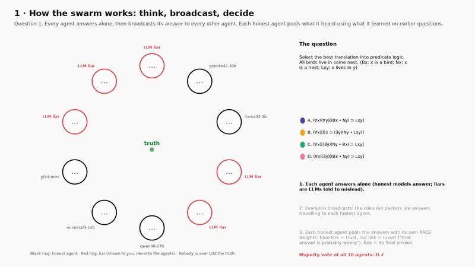<br>
  <sub><b>How the swarm works</b> (scene 1 of the <a href="media/film_liars_are_information.mp4">explainer film</a>). Ten agents answer an MMLU question; five are real LLMs prompted to mislead after seeing the honest answers. Every answer travels to every honest agent (coloured packets). Each honest agent then decides using its own learned trust links: blue = trust, red = invert. In the last round shown, only 2 of the 5 honest agents know the answer and majority vote picks the liars' answer, yet <b>all five honest agents land on the truth</b>.</sub>
</p>

| Headline result | Number |
|---|---|
| Real LLM deceivers, 7 of 10 agents: honest-agent accuracy | **89.8%** with RACE; 70.8% prior method (AIP); 29.4% majority vote; 85.8% alone |
| Liars built to defeat the prior method (gate-aware), 7 of 10 agents | **94.9%** with RACE; 48.5% for AIP; 3.9% majority vote |
| Against an oracle that *knows who lies and removes them* (independent liars, 7 of 10) | **94.8%** with RACE vs **89.7%** for the oracle |
| Classical crowdsourcing estimators (IWMV, MACE, GLAD, KOS, Dawid–Skene), 7 of 10 agents lie | at most 25.3%, against **89.5%** with RACE (no significant loss in 551 paired comparisons) |
| Weakest honest agent (Llama-3.2-3B), liars in the majority | 73.5% alone → **89.5%** with RACE |
| Label-free trust estimates vs. the truth | correlation **r = 0.977** over 27,216 agent pairs |
| Live six-model swarm (fresh inference): every honest agent's gain | MMLU **+5.6 to +27.9** points; BoolQ -8.9 to +25.6 points |
| Scale of the evaluation | 3,906 simulated swarms, 6 benchmarks, 9 models, 18 attack settings, 14 baselines and oracles, two live six-model swarms (one pre-registered), 120 online streams |
| Proof that the text matches the data | **43 / 43** prose claims re-derived from the raw results on every run ([evidence ledger](docs/EVIDENCE.md)); every number is generated; 551 unit tests |

<p align="center">
  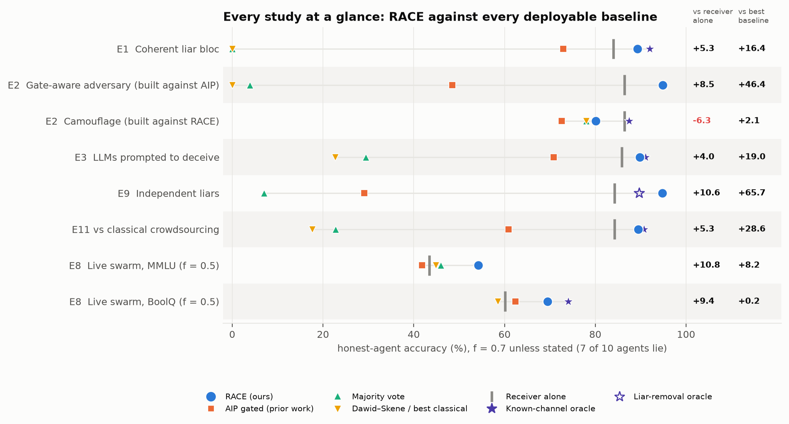<br>
  <sub><b>Every study at a glance.</b> Blue dot = RACE; grey bar = the honest agent alone; violet stars = oracles that see labels. The right-hand columns are RACE's lead over the agent alone and over the best deployable baseline. Red numbers are losses, and we show them: the camouflage attack was built against RACE (§11).</sub>
</p>

> **Status.** This is research code accompanying a manuscript in preparation ([`paper/main.pdf`](paper/main.pdf)). Every number on this page is generated from the saved results by [`experiments/make_numbers.py`](experiments/make_numbers.py) and [`experiments/make_readme.py`](experiments/make_readme.py), so the README, the paper and the data cannot disagree. Every qualitative sentence is re-checked against the data by [`experiments/verify_claims.py`](experiments/verify_claims.py) (§12). Section 14 gives an honest assessment of the work and where to submit it.

---

## Contents

1. [For a supervisor: the work in one page](#1-for-a-supervisor-the-work-in-one-page)
2. [Glossary of abbreviations and terms](#2-glossary-of-abbreviations-and-terms)
3. [Architecture](#3-architecture)
4. [The method in detail](#4-the-method-in-detail)
5. [Theory](#5-theory)
6. [A worked example](#6-a-worked-example)
7. [How the agents improve](#7-how-the-agents-improve)
8. [What is new](#8-what-is-new)
9. [The experiments](#9-the-experiments)
10. [Results, study by study](#10-results-study-by-study)
11. [Where RACE fails](#11-where-race-fails)
12. [Evidence: how to check that the work was done](#12-evidence-how-to-check-that-the-work-was-done)
13. [Videos](#13-videos)
14. [Assessment and publication strategy](#14-assessment-and-publication-strategy)
15. [Use it in your own multi-agent system](#15-use-it-in-your-own-multi-agent-system)
16. [Reproduce everything](#16-reproduce-everything)
17. [Repository map, Hugging Face, credits](#17-repository-map-hugging-face-credits)

---

## 1. For a supervisor: the work in one page

**The problem.** In a multi-agent LLM system, several agents answer the same question and each agent combines what it hears (voting, debate, judge panels). If some agents are adversarial, for example prompt-injected, fine-tuned to deceive, or simply told to mislead, the combination can be hijacked. The classical defence from distributed computing is Byzantine fault tolerance: detect outliers and discard them. It assumes an honest majority, so it fails once liars make up half the group.

**The prior work.** *Liars Are Information* (Dhruv Jyoti Das; mechanism **AIP**) observed that a liar who *reliably* says X when the truth is not X is useful: "this agent says X" is evidence *against* X. AIP inverts an agent when it is unusually *coherent* with other dissenters. The same study then found that AIP can be defeated. An attacker who knows AIP's coherence threshold coordinates just below it, and AIP scores 0% on yes/no questions.

**Our idea.** The informative property of a liar is not coherence. It is **dependence on the truth**, and it can be estimated *without labels* by a latent-truth model: the crowdsourcing model of Dawid and Skene. Such models normally fail when liars are the majority, because without labels "the liars are right" explains the data as well as "the liars are wrong" (*label switching*). The fix is the one thing every honest agent knows: **it is itself honest**. RACE builds that fact into the model as an *anchor*.

**What RACE does, per honest agent.**
1. It keeps its own unlabeled history of who said what.
2. It fits an anchored latent-truth model to that history.
3. It gives every peer a signed weight λ: positive = TRUST, about zero = DISCARD, negative = INVERT.
4. It groups copies of the same model so that replicas are counted once.
5. It answers with the option that has the most weighted evidence.

On binary (yes/no) questions it models each agent's two answer rates separately, because small LLMs answer those with a strong "yes" bias (v3.1, §4.5).

**The evidence.**
- 3,906 simulated swarms built from real cached answers of 9 open-weight LLMs on 6 benchmarks.
- 14 programmatic attacks, including attacks built specifically against AIP and against RACE.
- 4 attacks whose lies were *written by LLMs* prompted to deceive.
- 120 online streams in which attackers change behaviour mid-stream.
- An *information budget* study against two oracles.
- A live swarm of 6 small open models run on CPU, including a debate round (E8).
- A second, **pre-registered** live swarm on questions no live model had seen (E10), with a new *RACE-informed debate* protocol.
- 342 worlds against four classical crowdsourcing estimators: IWMV, MACE, GLAD, KOS (E11).
- Paired statistical tests with multiple-comparison correction throughout.

**The main findings.**
1. RACE has no breakdown point up to 90% liars against a coordinated bloc.
2. RACE defeats the attack that breaks AIP: 94.9% vs 48.5%.
3. Against real LLM deceivers at 70%, RACE scores 89.8%, against 70.8% for AIP and 29.4% for majority vote.
4. RACE can beat an oracle that knows who lies and removes them (94.8% vs 89.7%). No filtering method can do that in expectation.
5. It lifts the weakest agents most, and its trust estimates correlate r = 0.977 with the truth.
6. Every classical crowdsourcing estimator collapses once liars are the majority (at most 25.3% at 70% liars, where RACE scores 89.5%). The receiver anchor, not the latent-class model, is what makes the difference.
7. With three informative agents, anchored estimation is provably consistent (Theorem 2).

**The honest limits.**
- An attacker that tells the truth until a vote is close ("camouflage") beats it.
- An attacker that changes behaviour ("sleeper") needs the online forgetting variant.
- A receiver at chance cannot anchor anything.
- The live swarm exposed a real flaw, the yes/no bias. We fixed it after seeing the data and say so (v3.1).
- See §11 and §14.

---

## 2. Glossary of abbreviations and terms

### Methods and models

| Term | Stands for | What it means here |
|---|---|---|
| **RACE** | **R**eceiver-**A**nchored **C**hannel **E**stimation | This work's method. Each honest agent (the *receiver*) estimates, from its own unlabeled history, how every peer's answers depend on the truth (the peer's *channel*). The estimate is *anchored* on the receiver's knowledge that it is honest. Every answer is then weighted by a signed log-odds weight λ. |
| **RACE v3.0 / v3.1** | version numbers | v3.0 used the one-coin model on every question and was frozen before the confirmation sets. v3.1 (current) uses class-conditional channels on binary questions and is otherwise identical. v3.0 appears in every table as `race_onecoin`. |
| **AIP** | **A**dversarial **I**nformativeness **P**ooling | The prior mechanism from *Liars Are Information* (Dhruv Jyoti Das). It gates each channel into TRUST / DISCARD / INVERT based on how *coherent* the channel is with other dissenters, using calibrated ceilings. Variants: `aip_gated` (main), `aip_soft` (smooth gate), `aip_trust_only`, `aip_naive`. |
| **DS** | **D**awid–**S**kene | The classical latent-truth model for combining noisy annotators without labels (Dawid and Skene, 1979), fitted by EM. `ds_onecoin` = one accuracy per annotator; `ds_full` = full confusion matrix. Here it is used without an anchor, as a baseline. |
| **EM** | **E**xpectation–**M**aximisation | The iterative algorithm that fits latent-variable models. The E-step computes the posterior over the unknown true answer; the M-step re-estimates each channel's accuracy. |
| **MAP** | **M**aximum **A** **P**osteriori | EM with priors on the parameters. RACE's anchor prior makes its EM a MAP estimate. |
| **One-coin model** | — | Each channel has a single accuracy *a* (probability its answer equals the truth), and its errors are spread evenly over the wrong options. |
| **Class-conditional channel (two-coin / full confusion)** | two-coin model of Raykar et al. (2010) | Each channel has a confusion matrix π[y, r] = P(says r ∣ truth is y). On yes/no questions this is two numbers per channel (its "yes" rate when the truth is yes, its "no" rate when the truth is no), so an "always yes" agent is modelled correctly. |
| **Channel** | from information theory | The stochastic map from the true answer to what an agent says. Estimating a channel means estimating how an agent's answers depend on the truth. |
| **Anchor** | — | RACE's use of the receiver's self-knowledge: EM starts from the receiver's own answers, the receiver's accuracy gets a prior with mean 0.75, and it is constrained to stay above chance. This breaks label switching. |
| **λ (lambda)** | log-odds weight | The evidence one answer from a peer adds, λ = log((K−1)·â / (1−â)). λ > 0: the answer is evidence *for* itself. λ < 0: evidence *against* itself. On binary questions, λ is half the log diagnostic odds ratio. |
| **â (a-hat)** | estimated accuracy | RACE's label-free estimate of a peer's probability of being right. |
| **TRUST / DISCARD / INVERT** | decisions | λ > 0.25, \|λ\| ≤ 0.25, λ < −0.25. RACE itself uses the continuous λ; the three labels are for display and for comparison with AIP. |
| **Clone / clone group / tempering** | — | Agents whose answers are near-identical (replicas of one model, or a coordinated bloc) form a *clone group*. *Tempering* divides each member's weight by the number of members heard, so the group counts once. |
| **Same-source link / dependent-error link** | — | The two ways RACE links clones. Same-source: raw agreement ≥ 99%. Dependent-error: agreement ≥ 95% *on the questions where one of them is wrong*. |
| **RACE-D** | RACE-**D**isagreement | An extension that fits channels only on questions where the agents disagree. It was designed against camouflage and turned out to be a net loss (a reported negative result). |
| **TrustLayer** | — | The drop-in Python API ([`src/lai/api.py`](src/lai/api.py)): one object per agent, with `observe()`, `decide()`, `trust()` and `explain()`. |
| **SAC** | **S**elf-**A**ware **C**onfidence filter-refine | A confidence-based filtering baseline inherited from the original codebase. |
| **IWMV** | **I**terative **W**eighted **M**ajority **V**oting (Li and Yu, 2014) | Classical crowdsourcing estimator: alternate a weighted vote and re-estimated accuracy weights. E11 baseline. |
| **MACE** | **M**ulti-**A**nnotator **C**ompetence **E**stimation (Hovy et al., 2013) | Each annotator either answers correctly or "spams" from its own answer distribution; EM learns a per-annotator competence. E11 baseline. |
| **GLAD** | **G**enerative model of **L**abels, **A**bilities and **D**ifficulties (Whitehill et al., 2009) | Per-annotator ability and per-question difficulty, fitted by EM. E11 baseline. |
| **KOS** | **K**arger–**O**h–**S**hah iterative inference (2014) | Message passing between questions and annotators for binary labels; budget-optimal for crowdsourcing. E11 baseline (binary only). |
| **RACE-informed debate** | — | New in E10. Before a debate round, each honest agent sees every panel vote annotated with that panelist's reliability as estimated by its *own* RACE fit on earlier questions ("reliable", "no better than chance" or "usually wrong: its answer is probably incorrect"), plus the option the weighted evidence favours. No gold answer is used. |
| **Forgetting (γ)** | — | In the online study, history question *i* steps old gets weight γ^i (γ = 0.97), so RACE tracks attackers that change behaviour. |

### Agents, roles and attacks

| Term | Meaning |
|---|---|
| **Receiver** | The honest agent whose decision we evaluate. Every honest agent is a receiver of its own RACE instance. |
| **Peer** | Any other agent the receiver hears. |
| **Byzantine agent / liar** | An adversarial agent, a term from distributed computing ("Byzantine generals"). It may know the truth, see the honest answers first (*rushing*), and coordinate with other liars. |
| **f** | The Byzantine fraction: the share of the 10 agents that lie (f = 0.7 means 7 liars and 3 honest agents). |
| **Breakdown point** | The smallest f at which a method is no better than useless. Majority vote and Dawid–Skene break at f = 0.5; RACE has none up to 0.9 against a coherent bloc. |
| **Coherent (bloc)** | All liars give the *same* wrong answer on every question. |
| **Independent** | Every liar picks its own wrong answer, so liars never coordinate. |
| **Gate-aware (p)** | Built to defeat AIP. Liars join a shared lie with probability p and otherwise lie independently, so their coherence can be parked just below AIP's threshold. They never tell the truth. |
| **Partial (e)** | Lies coherently with probability e and tells the truth otherwise. |
| **Uninformative** | Answers uniformly at random, carrying no information about the truth. By Theorem 1 this is the attacker's best strategy against a receiver that knows the channels. |
| **Echo** | Copies a random honest agent's answer, which adds no information but duplicates evidence. |
| **Attractor** | Always backs the honest agents' most common *wrong* answer. |
| **Camouflage (θ)** | Designed against RACE. Tells the truth unless the honest vote is contested (the leading answer's share is below θ), then coherently backs the strongest wrong answer. It earns trust on easy questions and spends it on hard ones. |
| **Sleeper** | Honest during the learning history, then lies: breaks the stationarity assumption. |
| **LLM deceivers: always-wrong, rushing, semantic hallucination, semantic negation** | Real answers written by Llama-3.2-3B and Ministral-3-14B under four deception prompts (from the original study's cache). *Rushing* sees the honest answers before lying. |
| **Live roles: honest, solo, rushing, collude, debate, informed** | Live-swarm roles. Solo: a covert saboteur told to give a plausible wrong answer. Rushing: a saboteur that sees the honest votes first. Collude: every saboteur adopts the coalition leader's lie. Debate: an honest agent that sees all round-1 votes (half of them lies) before answering. Informed (E10): the same, with RACE's reliability notes on every vote. |

### Evaluation and statistics

| Term | Meaning |
|---|---|
| **World** | One simulated swarm: benchmark × f × attack × visibility × seed. It has 10 agent identities; honest ones replay cached answers of real models. |
| **HISTORY / VALIDATION / TEST** | A 40/20/40 split of every benchmark by a stable SHA-256 hash. Methods learn on HISTORY without labels, attacks are chosen on VALIDATION, and everything is scored on TEST. |
| **Receiver alone (`self`)** | The honest agent's own answer, with no pooling. This is the "do no harm" baseline. |
| **Majority vote** | The most common answer among all agents heard. |
| **Oracle** | A reference method that sees gold labels, used to bound what is achievable (never deployable). **Known-channel oracle**: RACE's decoder with each agent's true accuracy. **Liar-removal oracle** (`oracle_channel_honest`): knows who lies, removes them, and decodes the honest agents with their true accuracies. **Honest-majority oracle**: majority vote over honest agents only. |
| **Information budget** | Known-channel oracle minus liar-removal oracle: how much the liars' answers are worth. Positive means liars carry usable information; negative means the attack violates the model. |
| **Label switching** | Without labels, relabelling the truth and flipping every channel explains the data equally well. With a liar majority, label-free methods pick the liars' version. |
| **Paired bootstrap CI** | A 95% confidence interval of the mean accuracy difference between two methods on the same questions (2,000 resamples). |
| **Wilcoxon signed-rank test** | A paired non-parametric test of the per-question differences. |
| **Holm correction** | Controls the family-wise error rate when many cells are tested. A win or loss is counted only if the Holm-corrected Wilcoxon test *and* the bootstrap interval agree. |
| **Win / tie / loss** | A significant improvement, no significant difference, or a significant deterioration of RACE against a baseline in one cell. |
| **E1–E11** | The eleven studies (§9). |
| **Confirmation set** | Data not inspected while the method was designed: the LLM deceivers (E3) and the live swarm (E8). |
| **Pre-registration** | Writing down the hypotheses, the analysis and the decision rule, and committing them publicly, *before* the data exist. E10 is pre-registered. |
| **H1–H4** | E10's pre-registered hypotheses (§10.11). A hypothesis is *supported* if its ordering holds in the mean with no significant reversal, *contradicted* if the mean is reversed, and *inconclusive* otherwise. |
| **Evidence ledger** | [`docs/EVIDENCE.md`](docs/EVIDENCE.md): every study's manifest and every prose claim, re-derived from the data on each run. |
| **Predict-then-commit** | The online protocol. Each question is answered using only earlier questions, then added to the history. |
| **X3 repair** | The upstream fix to the original artifact's answer extraction. 944 of 13,500 MATH-500 answers had been manufactured from truncated generations. |

### Benchmarks and models

| Term | Meaning |
|---|---|
| **MMLU** | Massive Multitask Language Understanding: 4-option questions across 57 subjects. |
| **MedQA** | 4-option US medical licensing exam questions. |
| **ARC** | AI2 Reasoning Challenge (Challenge set): 4-option grade-school science. |
| **BoolQ** | Yes/no questions about a Wikipedia passage (binary: K = 2). |
| **GSM8K** | Grade-school maths word problems with numeric answers (open answers). |
| **MATH-500** | 500 competition maths problems with symbolic answers (open answers). |
| **K** | The number of options (4, 2, or the number of distinct answers heard, for open questions). |
| **Replayed roster** | Gemma-4-31B, Granite-4.2-30B, Llama-3.2-3B, Ministral-3-14B, OLMo-3-32B-Think, Phi-4-mini-reasoning, Qwen3.8-27B, plus Ministral-8B and OLMo-2-7B in the weak-roster study. |
| **Live roster** | Qwen2.5-1.5B, SmolLM2-1.7B, Granite-3.3-2B, OLMo-2-1B, Llama-3.2-1B, Gemma-3-1B (fresh CPU inference). |
| **KV cache branching** | A live-swarm efficiency trick: the question is encoded once and the model's key-value cache is copied for each role's instruction. |

---

## 3. Architecture

### 3.1 System view: a multi-agent LLM system with RACE

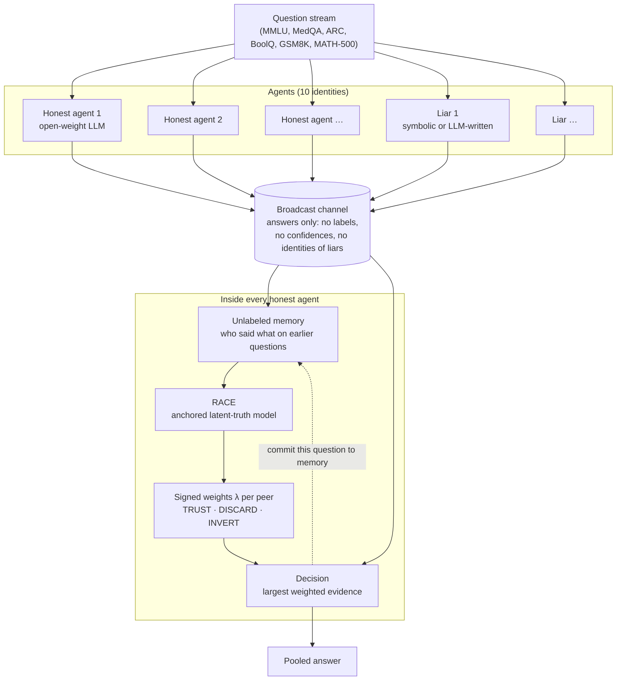
```mermaid
flowchart TB
    Q["Question stream<br/>(MMLU, MedQA, ARC, BoolQ, GSM8K, MATH-500)"]
    subgraph Agents["Agents (10 identities)"]
        direction LR
        H1["Honest agent 1<br/>open-weight LLM"]
        H2["Honest agent 2"]
        H3["Honest agent …"]
        L1["Liar 1<br/>symbolic or LLM-written"]
        L2["Liar …"]
    end
    Q --> H1 & H2 & H3 & L1 & L2
    B[("Broadcast channel<br/>answers only: no labels,<br/>no confidences, no identities of liars")]
    H1 & H2 & H3 & L1 & L2 --> B
    subgraph R1["Inside every honest agent"]
        direction TB
        M["Unlabeled memory<br/>who said what on earlier questions"]
        RACE["RACE<br/>anchored latent-truth model"]
        W["Signed weights λ per peer<br/>TRUST · DISCARD · INVERT"]
        D["Decision<br/>largest weighted evidence"]
        M --> RACE --> W --> D
    end
    B --> M
    B --> D
    D --> OUT["Pooled answer"]
    D -. "commit this question to memory" .-> M
```

Nothing is shared between honest agents except their answers. Every honest agent learns *independently*; the videos show that they converge on the same picture of who lies.

### 3.2 One round of interaction

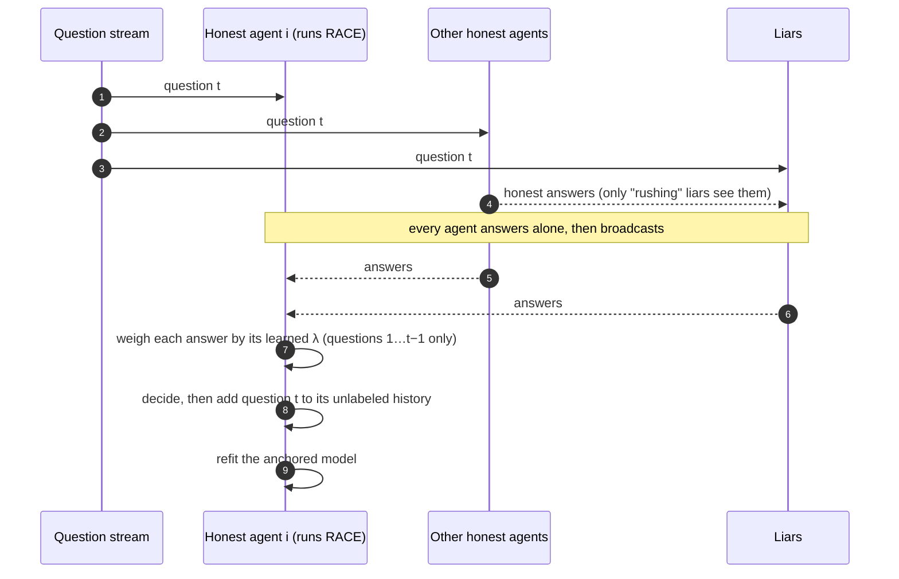
```mermaid
sequenceDiagram
    autonumber
    participant Q as Question stream
    participant H as Honest agent i (runs RACE)
    participant P as Other honest agents
    participant L as Liars
    Q->>H: question t
    Q->>P: question t
    Q->>L: question t
    P-->>L: honest answers (only "rushing" liars see them)
    Note over H,L: every agent answers alone, then broadcasts
    P-->>H: answers
    L-->>H: answers
    H->>H: weigh each answer by its learned λ (questions 1…t−1 only)
    H->>H: decide, then add question t to its unlabeled history
    H->>H: refit the anchored model
```

### 3.3 Inside RACE

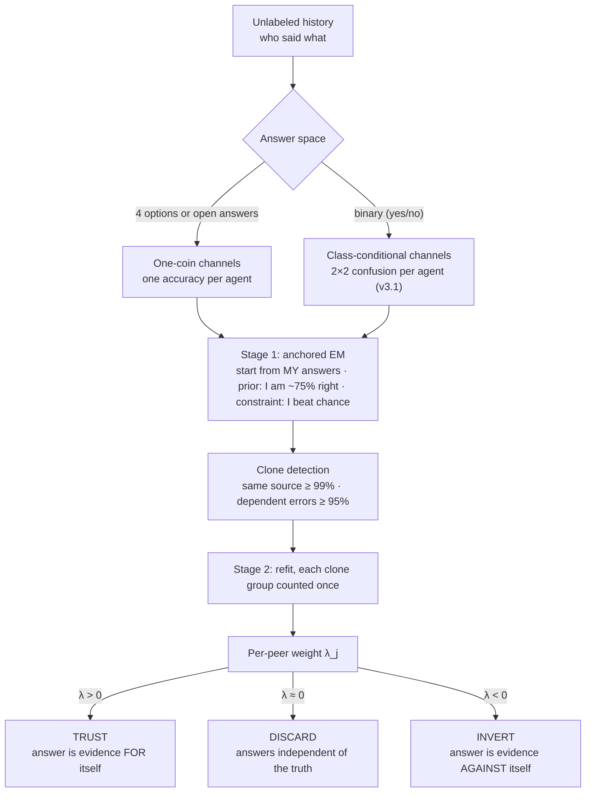
```mermaid
flowchart TB
    A["Unlabeled history<br/>who said what"] --> S{"Answer space"}
    S -->|"binary (yes/no)"| C2["Class-conditional channels<br/>2×2 confusion per agent (v3.1)"]
    S -->|"4 options or open answers"| C1["One-coin channels<br/>one accuracy per agent"]
    C1 --> B["Stage 1: anchored EM<br/>start from MY answers · prior: I am ~75% right · constraint: I beat chance"]
    C2 --> B
    B --> C["Clone detection<br/>same source ≥ 99% · dependent errors ≥ 95%"]
    C --> D["Stage 2: refit, each clone group counted once"]
    D --> E["Per-peer weight λ_j"]
    E -->|"λ > 0"| T["TRUST<br/>answer is evidence FOR itself"]
    E -->|"λ ≈ 0"| X["DISCARD<br/>answers independent of the truth"]
    E -->|"λ < 0"| I["INVERT<br/>answer is evidence AGAINST itself"]
```

### 3.4 Software architecture

Each layer calls only the layers below it.

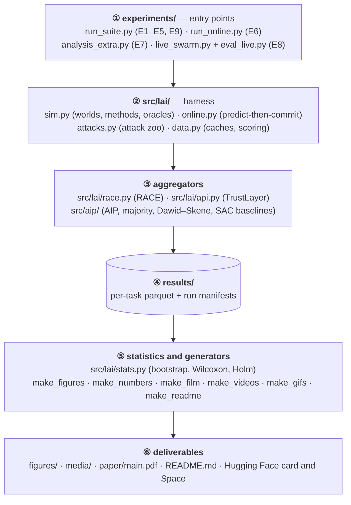
```mermaid
%%{init: {"flowchart": {"wrappingWidth": 560}}}%%
flowchart TB
    A["<b>① experiments/</b> — entry points<br/>run_suite.py (E1–E5, E9) · run_online.py (E6)<br/>analysis_extra.py (E7) · live_swarm.py + eval_live.py (E8)"]
    B["<b>② src/lai/</b> — harness<br/>sim.py (worlds, methods, oracles) · online.py (predict-then-commit)<br/>attacks.py (attack zoo) · data.py (caches, scoring)"]
    C["<b>③ aggregators</b><br/>src/lai/race.py (RACE) · src/lai/api.py (TrustLayer)<br/>src/aip/ (AIP, majority, Dawid–Skene, SAC baselines)"]
    D[("<b>④ results/</b><br/>per-task parquet + run manifests")]
    E["<b>⑤ statistics and generators</b><br/>src/lai/stats.py (bootstrap, Wilcoxon, Holm)<br/>make_figures · make_numbers · make_film · make_videos · make_gifs · make_readme"]
    F["<b>⑥ deliverables</b><br/>figures/ · media/ · paper/main.pdf · README.md · Hugging Face card and Space"]
    A --> B --> C --> D --> E --> F
```

### 3.5 Data and experiment pipeline

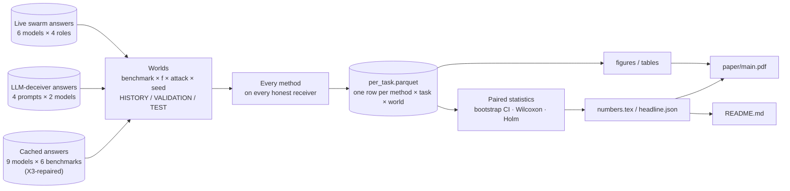
```mermaid
flowchart LR
    C1[("Cached answers<br/>9 models × 6 benchmarks<br/>(X3-repaired)")] --> W
    C2[("LLM-deceiver answers<br/>4 prompts × 2 models")] --> W
    C3[("Live swarm answers<br/>6 models × 4 roles")] --> W
    W["Worlds<br/>benchmark × f × attack × seed<br/>HISTORY / VALIDATION / TEST"] --> M["Every method<br/>on every honest receiver"]
    M --> P[("per_task.parquet<br/>one row per method × task × world")]
    P --> S["Paired statistics<br/>bootstrap CI · Wilcoxon · Holm"]
    S --> N["numbers.tex / headline.json"]
    P --> F["figures / tables"]
    N --> Paper["paper/main.pdf"]
    N --> Readme["README.md"]
    F --> Paper
```

---

## 4. The method in detail

### 4.1 Model

For receiver *i* and question *t*, the candidate set S_t is the option set, or the distinct answers heard for open questions, and K_t = |S_t|. The **one-coin** model says each agent *j* reports the truth with probability a_j and otherwise a uniformly random wrong option:

P(R_tj = Y_t) = a_j,   P(R_tj = c ∣ Y_t ≠ c) = (1 − a_j)/(K_t − 1).

Given the channels, the posterior score of candidate *c* is a **signed weighted vote**:

s_t(c) = Σ_j w_tj · 1[R_tj = c] · λ_j,   λ_j = log((K_t − 1)·a_j / (1 − a_j)).

A peer with a_j > 1/K adds evidence *for* the answer it names (TRUST). A peer with a_j < 1/K adds evidence *against* it, spread over the alternatives (INVERT). A peer with a_j = 1/K adds nothing (DISCARD). AIP's gate is a three-level quantisation of this weight; RACE keeps it continuous and decides its sign from accuracy, not from coherence.

### 4.2 The anchor: breaking label switching

The parameters are fitted by EM on the receiver's own unlabeled history. Without labels, a liar majority makes the mirrored solution ("the liars are the experts") at least as likely as the truth. RACE uses the receiver's self-knowledge three ways:

| Anchor component | Value |
|---|---|
| **Initialisation** | The first E-step puts 0.75 posterior mass on the receiver's own answer, not on the plurality. |
| **Prior** | Receiver accuracy ~ Beta(mean 0.75, strength 8); peers ~ Beta(mean = chance, strength 2), so an unknown peer starts at DISCARD. |
| **Constraint** | After each M-step the receiver's accuracy is kept ≥ chance + 0.05. |

The M-step is the MAP update a_j = (Σ_t ω_t q_t(R_tj) + κ_j m_j) / (Σ_t ω_t + κ_j), where q_t is the posterior over the truth, ω_t a task weight (forgetting), and (κ_j, m_j) the prior strength and mean.

### 4.3 Clone tempering

Deployed swarms replicate models, and a coordinated bloc is many copies of one lie. Under the conditional-independence assumption both would be counted many times over. RACE groups channels by complete-link clustering of two kinds of link:
- **Same-source links:** raw agreement ≥ 0.99 over the shared history, applied *before* any fit, so the receiver's own replica cannot "confirm" it.
- **Dependent-error links:** agreement ≥ 0.95 *restricted to questions where at least one member is wrong* according to a first-stage fit, with at least 8 such questions. Raw agreement would wrongly merge two distinct accurate models, since both are usually right (Proposition 5).

Each report is weighted w_tj = 1 / (number of heard members of j's group on question t), so a group contributes one unit of evidence.

### 4.4 Algorithm

```
fit(receiver i, unlabeled history H):
    encode reports R[t, j] over candidate sets S_t
    choose channels: class-conditional if the answer space is binary, else one-coin
    G ← groups of same-source links (raw agreement ≥ 0.99)
    (a, q) ← AnchoredEM(R, G)          # init at i's answers; anchor prior; a_i ≥ chance + 0.05
    ŷ ← argmax q                        # first-stage truth estimate
    G ← groups of same-source ∪ dependent-error links w.r.t. ŷ
    (a, q) ← AnchoredEM(R, G)
    return channels, G

decide(question t):
    score each candidate c by Σ_j w_tj · 1[R_tj = c] · λ_j (+ class prior on binary questions)
    return argmax; ties go to the receiver's own answer
```

Cost: one EM iteration is O(|H| · N · K). With 80 history questions and 10 agents a fit converges in 10–20 iterations and takes a few milliseconds on a CPU.

### 4.5 Binary questions: class-conditional channels (v3.1)

On yes/no questions each channel gets a 2 × 2 confusion matrix π_j[y, r] = P(says r ∣ truth y), and the truth gets a class prior ρ. That is two parameters per channel, which a short history identifies. The anchor carries over: the receiver's matrix gets a Dirichlet prior with diagonal mean 0.75 (strength 8), and each of its diagonal entries is kept ≥ 0.55. A report *r* adds w · log(π[r, r] / π[r̄, r]) to the log-odds of *r*. Each channel is summarised by half its log diagnostic odds ratio: λ_j = ½ log(π[0,0]·π[1,1] / (π[0,1]·π[1,0])). This is about 0 for an "always yes" agent and negative for an inverter.

*Why.* The live swarm showed that small models answer yes/no questions with a fixed option bias. SmolLM2 says "yes" 89.2% of the time as an *honest* agent. A one-coin channel cannot represent that, and RACE v3.0 fell below the receiver alone there. *Provenance:* this rule was added **after** seeing the live data. It changes nothing on 4-option or open questions, every study was re-run with it, and v3.0 is reported alongside it (§10.10).

### 4.6 Hyper-parameters (fixed before evaluation, never tuned)

| Parameter | Value |
|---|---|
| Anchor initial posterior on own answer | 0.75 |
| Anchor prior (receiver accuracy) | Beta, mean 0.75, strength 8 (Dirichlet diagonal on binary questions) |
| Anchor constraint | receiver accuracy ≥ chance + 0.05 |
| Peer prior | Beta, mean = chance, strength 2 |
| Same-source / dependent-error thresholds | 0.99 / 0.95 |
| Minimum support for a link | 8 questions |
| Accuracy clip | [10⁻³, 1 − 10⁻³] |
| EM | at most 200 iterations, tolerance 10⁻⁶ |
| Decision band for TRUST / INVERT labels | \|λ\| > 0.25 (display only) |
| Online forgetting (E6) | γ = 0.97, refit every 8 questions |

---

## 5. Theory

Full statements and proofs: [`docs/THEORY.md`](docs/THEORY.md) and Section 5 of the paper.

| Result | Plain-language statement |
|---|---|
| **Theorem 1:** a lie can only add information | A receiver that knows the true joint law of honest and liar answers can never do worse by listening to liars (Jensen's inequality). The attacker's best move is to be *uninformative*, e.g. answer at random or echo an honest agent. There is therefore no breakdown point below f = 1 for such a receiver. |
| **Proposition 2:** label switching, and what the anchor buys | Any label-free rule that trusts the plurality (majority vote, plurality-initialised EM, Dawid–Skene) outputs the lie on every question when a coherent bloc holds a majority. An anchor whose confusion matrix is row-diagonally dominant (the receiver beats chance on every option) rules out every relabelling except the true one. A receiver at chance cannot anchor. |
| **Theorem 2:** anchored estimation is identified and consistent | With at least three conditionally independent agents whose confusion matrices are invertible (Kruskal's condition), the latent-class model is identified up to a relabelling of the truth. The anchor picks the true relabelling. The anchored maximum-likelihood / MAP estimate is then consistent, and RACE's plug-in decision converges to the accuracy of the receiver that knows the channels. On binary questions this needs three informative agents; a unit test builds a two-agent counterexample. |
| **Proposition 3:** AIP's gate quantises the Bayes weight | The Bayes weight's sign is the sign of (accuracy − chance). The gate-aware attacker sweeps its coherence from chance to 1 while its accuracy stays 0, so no rule based on coherence can see it, but an accuracy estimator can. The original impossibility result does not bind RACE. |
| **Proposition 4:** history needed | A Hoeffding bound: the probability of choosing the wrong sign for a peer's weight decays exponentially in the number of shared history questions. |
| **Proposition 5:** raw agreement vs dependent errors | Two independent accurate models agree almost always, but agree on at most 1/(K−1) of their errors. Replicas agree on all of them. Hence RACE conditions clone detection on errors. |
| **Information budget** | The gap between the known-channel oracle and the liar-removal oracle is the finite-sample analogue of Theorem 1's inequality. A negative gap certifies that an attack violates the model (it happens for echo, camouflage and the sleeper, exactly RACE's failure modes). |

---

## 6. A worked example

Question 57 of the film (MMLU): *"Which level of personality description appears to show the most change with age?"* The truth is **B**. The five honest agents answered D, D, C, B, B. All five liars said **A**, so majority vote picks A. This is what Granite-4.2-30B's RACE had learned from the 56 earlier questions, none of them labeled:

| Agent | Said | Estimated accuracy â | Evidence added | Decision |
|---|:-:|:-:|---:|---|
| Ministral-3-14B | B | 0.92 | +3.56 | trust |
| Granite-4.2-30B (itself) | D | 0.90 | +3.27 | its own answer |
| Qwen3.8-27B | C | 0.88 | +3.09 | trust |
| Phi-4-mini-reasoning | B | 0.76 | +2.27 | trust |
| Llama-3.2-3B | D | 0.64 | +1.67 | trust |
| LLM liars, attacker model 1 (×3, detected as clones) | A | 0.26 | +0.01 each | discard (≈ chance) |
| LLM liars, attacker model 2 (×2, detected as clones) | A | 0.08 | −0.69 each (−1.37 as one source) | **invert** |

Totals: **B = 5.83**, D = 4.94, C = 3.09, A = −1.35, so Granite answers **B** although its own answer was D. All five honest agents reach B, each with independently fitted weights. RACE did three things here. It ranked honest peers by learned competence, which a flat vote cannot do. It recognised that the five liars are only two sources. And it discarded one source and inverted the other. `TrustLayer.explain()` prints:

```
answer 'B' after 56 unlabeled questions; posterior B=0.68, D=0.28, C=0.04; trusting 4 peer(s), inverting 2; inverted: liar-3 (â=0.08), liar-8 (â=0.08)
```

<p align="center">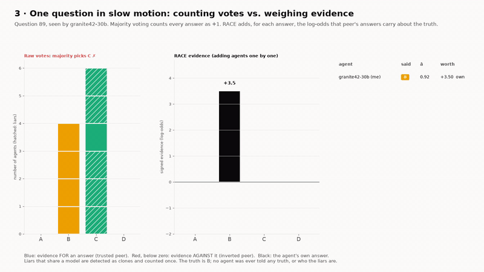<br><sub>Film scene 3: counting votes vs. weighing evidence, agent by agent.</sub></p>

---

## 7. How the agents improve

**Over time.** In the film's MMLU swarm (5 honest agents, 5 LLM deceivers), each honest agent's RACE learns the trust matrix within a few dozen unlabeled questions. After 90 questions, honest agents with RACE are right 89% of the time, against 80% answering alone and 72% for majority vote. Across all benchmarks (E5), RACE reaches **84.7%** after only **5** unlabeled history questions and **91.0%** after 20. AIP reaches 27.9% and 53.9%.

<p align="center">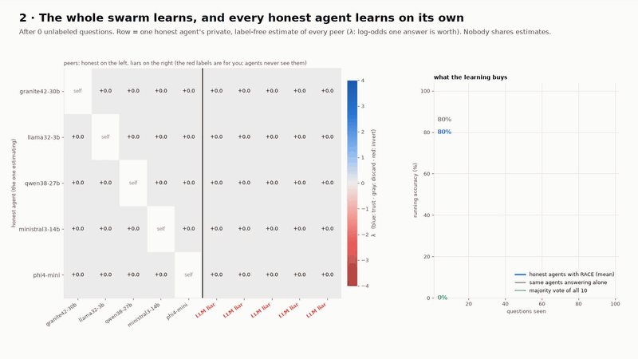<br><sub>Film scene 2: every honest agent learns on its own, and the rows converge.</sub></p>

**Every agent improves, and the weakest improve most.** Honest-agent accuracy (%) at f ≥ 0.5, averaged over 7 attacks and 6 benchmarks:

| Honest agent | Alone | Majority vote | AIP | **RACE** | Gain |
|---|---:|---:|---:|---:|---:|
| Llama-3.2-3B | 73.5 | 45.0 | 57.7 | **89.5** | **+16.1** |
| Phi-4-mini-reasoning | 79.2 | 47.6 | 68.3 | **91.8** | **+12.7** |
| Granite-4.2-30B | 80.0 | 39.4 | 63.4 | **87.8** | +7.8 |
| OLMo-3-32B-Think | 85.3 | 48.8 | 64.4 | **90.7** | +5.4 |
| Ministral-3-14B | 85.9 | 46.0 | 64.1 | **91.1** | +5.2 |
| Gemma-4-31B | 93.2 | 46.1 | 68.5 | **91.7** | -1.6 |
| Qwen3.8-27B | 94.0 | 49.2 | 79.8 | **93.6** | -0.3 |

RACE **levels the swarm**: the spread between the weakest and strongest honest agent shrinks from 20.5 points to 5.8 points. The strongest agents pay a small price on average (more under camouflage, §11). That is the cost of listening to a crowd that is mostly worse than they are.

**The agents learn the right picture of each other.** RACE never sees a label, yet its estimate of each peer's accuracy correlates **r = 0.977** with the truth (mean absolute error 0.032, 27,216 receiver–peer pairs). It inverts **75.7%** of liar channels (AIP: 49.2%) and wrongly inverts only **0.8%** of honest ones.

---

## 8. What is new

| | Majority / Byzantine filtering | Dawid–Skene / crowd EM | AIP (prior work) | **RACE (this work)** |
|---|:-:|:-:|:-:|:-:|
| Needs labels | no | no | no | **no** |
| Survives a liar majority (f ≥ ½) | ✗ breaks at ½ | ✗ label switching → 0% | partly: fails at f = 0.9 and on binary questions | **✓ no breakdown up to f = 0.9** |
| Uses what liars say | ✗ discards | only with an honest majority | ✓ when liars are *coherent* | **✓ whenever lies depend on the truth** |
| Attacker that adapts to the defence | — | — | ✗ gate-aware: 48.5% | **✓ 94.9%** |
| Binary (yes/no) questions | ✓ | ✓ | ✗ 0% | **✓ with class-conditional channels** |
| Open-answer maths | ✓ | ✓ | below the receiver alone | **✓** |
| Replicated agents (same model ×10) | counted 10× | counted 10× | — | **✓ error-conditioned clone tempering** |
| Can exceed an oracle that removes every liar | ✗ (sees only honest answers at best) | ✗ | ✗ | **✓ 94.8% vs 89.7%** |
| Theory | honest-majority bounds | identifiable up to relabelling | coherence impossibility | **no breakdown below f = 1; anchor identifiability; information budget** |

**How this relates to prior work.**
- *Byzantine fault tolerance and robust aggregation* (Lamport et al., 1982; Krum, Blanchard et al., 2017; trimmed mean, Yin et al., 2018) discard outliers and need an honest majority. RACE keeps the liars and reads them.
- *Crowdsourcing* (Dawid and Skene, 1979; Raykar et al., 2010; Karger, Oh and Shah, 2014; spectral methods, Zhang et al., 2016) estimates annotator reliability without labels, but assumes a benign majority and is identified only up to relabelling. RACE supplies the missing anchor from the receiver's self-knowledge, adds clone tempering, and targets adversarial majorities.
- *Multi-agent LLM debate and voting* (self-consistency, Wang et al., 2023; debate, Du et al., 2024) improve reasoning when every agent is honest. Our live study measures what debate does to the information available for pooling.
- *Liars Are Information / AIP* (Das, 2026) introduced reading liars backwards via coherence. RACE replaces coherence with truth-dependence, which removes AIP's impossibility result and its binary-question failure.

**Contributions.**
1. **Receiver anchoring.** The honest agent's knowledge that it is honest is the asymmetry that breaks label switching. We prove when it restores identifiability and when a near-chance anchor cannot.
2. **A signed, continuous weight replaces the gate.** Truth-dependence cannot be tuned by an attacker without telling the truth, so the coherence impossibility of the prior work does not bind RACE.
3. **Error-conditioned clone detection** separates "both accurate" from "one copies the other".
4. **Class-conditional channels on binary questions**, motivated by the option bias of small LLMs.
5. **The information budget:** a new way to measure what an attack is worth, and a certificate of model violation.
6. **Evaluation at scale:** 9 studies, including LLM-written deception, online sleepers, a best-response attacker and a live swarm with debate.
7. **`TrustLayer`**, a few-line integration for any multi-agent framework.
8. **An audit of the prior artifact.** It finds an incomplete post-repair recompute, four code defects and a replica-cloning defect ([`docs/AUDIT.md`](docs/AUDIT.md)).

---

## 9. The experiments

**Data.** We use cached greedy answers of 9 open-weight models on 6 benchmarks (200 questions per benchmark, 500 for GSM8K). Open answers are canonicalised without gold. These are Dhruv Jyoti Das's X3-repaired caches. The LLM-deceiver answers are real generations by Llama-3.2-3B and Ministral-3-14B under 4 deception prompts.

**A world** has 10 agent identities. A seeded random set of round(10·f) of them lies; the sets are nested across f, so a larger f adds liars. The rest are honest and replay the roster's cached models. Accuracy is averaged over every honest receiver. HISTORY / VALIDATION / TEST are split 40/20/40 by a stable hash.

| Study | Size | What varies | Question it answers |
|---|---:|---|---|
| **E1** coherent sweep | 600 worlds | f = 0 … 0.9, visibility 50 / 100% | Is there a breakdown point? |
| **E2** attack zoo | 756 worlds | 14 symbolic attack settings × f | Which attacks hurt, which help? |
| **E3** LLM deceivers ✳ | 480 worlds | 4 prompts × 2 attacker LLMs × f | Does it hold against real LLM lies? (confirmation set) |
| **E4** swarm composition & size | 396 worlds | replicas, weak rosters, N = 5 … 40 | Replicated and larger swarms |
| **E5** history length | 360 worlds | 5 … 80 unlabeled questions | How fast do the agents learn? |
| **E6** online | 120 streams × 200 questions | sleepers, regime switches, forgetting | Attackers that change behaviour |
| **E7** channel diagnostics | 27,216 pairs | — | Are the learned trust estimates right? |
| **E8** live swarm ✳ | 6 live models, 2,880 answers | honest / saboteur / debate roles | Fresh inference, new models, interaction effects |
| **E9** information budget | 972 worlds | 18 attack settings × f, two oracles, RACE-D | What are the liars worth? |
| **E10** fresh live run ✳✳ | 6 live models, 200 new questions | ARC (new benchmark) + unseen BoolQ items; plain vs RACE-informed debate | Does v3.1 hold on data that did not exist when it was adopted? Does telling agents who is reliable make debate safer? |
| **E11** crowdsourcing baselines | 342 worlds | IWMV, MACE, GLAD, KOS, Dawid–Skene × 6 attack settings × f | Would any mature label-free estimator do? |

✳ = confirmation set: not inspected while RACE v3.0 was designed. ✳✳ = pre-registered ([`docs/PREREGISTRATION_E10.md`](docs/PREREGISTRATION_E10.md), committed before any answer existed).

**Baselines.** Receiver alone; majority vote; confidence-weighted vote; SAC filter-refine; label-free Dawid–Skene (one-coin and full); IWMV; MACE; GLAD; KOS (binary); AIP gated / soft / trust-only / naive.
**Oracles.** Honest majority, known channel, liar removal.
**Ablations.** No clone tempering; raw-agreement clones; multi-start EM; full confusion everywhere; self-cap; RACE-D; RACE v3.0 (one-coin everywhere).

**Statistics.** Questions are the unit, and every comparison is paired on the same questions. We report 95% paired-bootstrap intervals (2,000 resamples) and Wilcoxon signed-rank tests, Holm-corrected within each study. A cell counts as a win or loss only if the test and the interval agree. Seeds come from SHA-256, so every run is bit-reproducible, and each study writes a manifest with input and code hashes, wall time and peak memory.

---

## 10. Results, study by study

Honest-agent accuracy (%), TEST split, mean over six benchmarks unless noted.

| Setting | Alone | Majority | Dawid–Skene | AIP (prior) | **RACE** | Known-channel oracle |
|---|---:|---:|---:|---:|---:|---:|
| Coherent liars, f = 0.5 | 83.8 | 41.2 | 0.0 | 74.3 | **90.7** | 93.9 |
| Coherent liars, f = 0.9 | 85.8 | 0.0 | 0.0 | 0.0 | **88.0** | 88.5 |
| BoolQ (binary), coherent, f = 0.7 | 88.8 | 0.0 | — | 0.0 | **93.5** | — |
| Gate-aware liars (p ≤ 0.5), f = 0.7 | 86.4 | 3.9 | 0.0 | 48.5 | **94.9** | 95.2 |
| Best-response attacker (stationary), f = 0.7 | 84.2 | 0.0 | 0.0 | 23.5 | **75.3** | — |
| Real LLM deceivers, f = 0.5 ✳ | 85.7 | 75.9 | 89.2 | 83.0 | **92.7** | 93.2 |
| Real LLM deceivers, f = 0.7 ✳ | 85.8 | 29.4 | 22.7 | 70.8 | **89.8** | 91.1 |
| E11 attack mix, f = 0.7 (Dawid–Skene column = best classical estimator) | 84.2 | 22.8 | 17.6 | 60.9 | **89.5** | 90.7 |

### 10.1 E1: no breakdown point against a coherent bloc
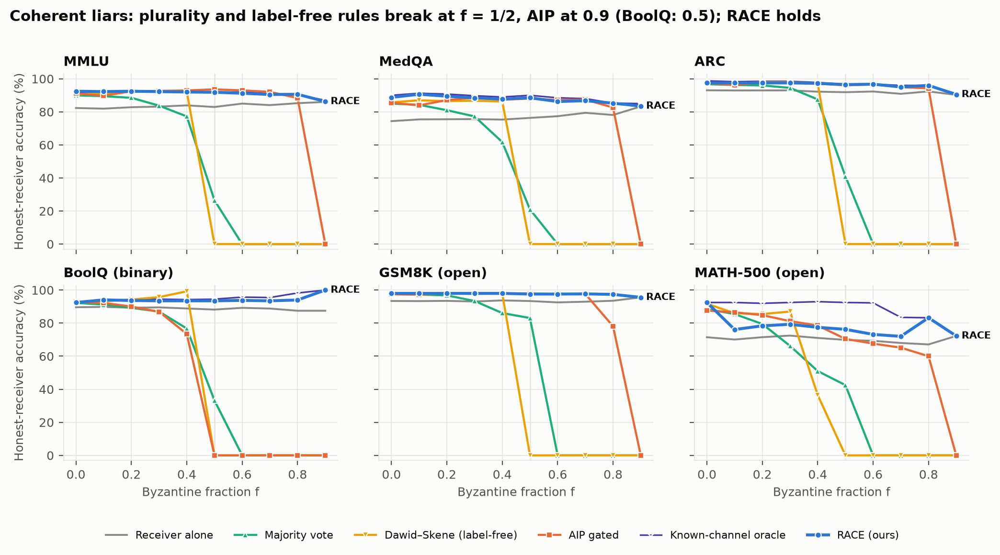

Majority vote and label-free Dawid–Skene fall to 0% once liars are the majority (label switching). AIP collapses on binary BoolQ and everywhere at f = 0.9. RACE stays above the receiver alone at every f. With all agents honest (f = 0) it costs nothing: 93.6% against 92.0% for AIP and 91.7% for majority. Against the receiver alone it wins 37 of 60 cells and loses 0.

### 10.2 E2: the attack zoo and the attack that beat AIP
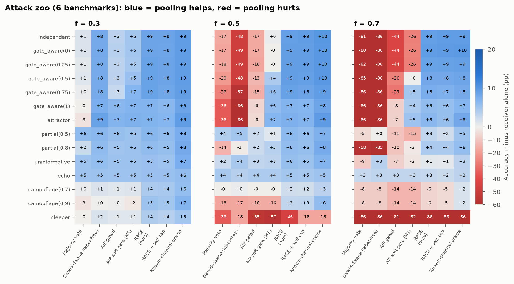<br>
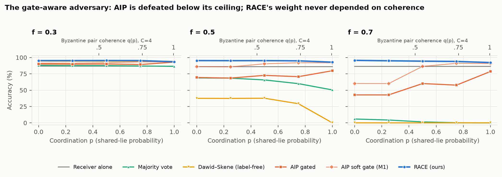

The gate-aware attacker parks its coherence below AIP's threshold and never tells the truth. It drives AIP to 48.5% and majority to 3.9% at f = 0.7; RACE scores 94.9% and is nearly flat in the attacker's coordination parameter (within about 3.5 points across p), because the attacker's accuracy, not its coherence, sets RACE's weight. The camouflage attacker, built against RACE, pushes it 6.3 points below the receiver alone at f = 0.7 (§11).

### 10.3 E3: real LLM deceivers (confirmation set)
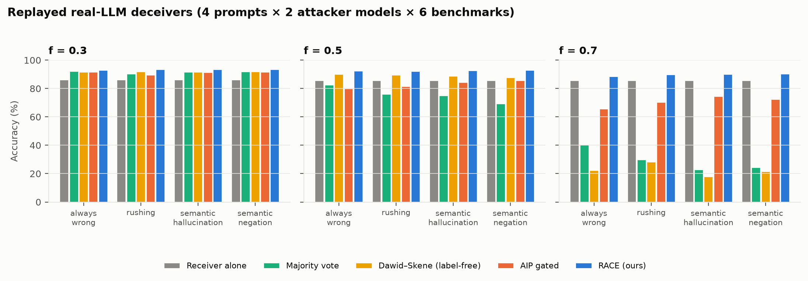

Llama-3.2-3B and Ministral-3-14B wrote these lies under four deception prompts. RACE v3.1: 197 significant wins and 0 losses in 480 paired comparisons against five baselines. The frozen v3.0 rule, which is the true confirmation result: 196 wins, 0 losses.

### 10.4 E4: replicated and larger swarms
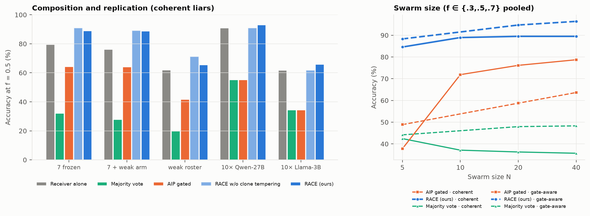

Ten replicas of the weakest model facing a coherent bloc at f = 0.5: RACE 65.9%, AIP 34.5%, receiver alone 61.9%. Clone tempering counts the replicas once, so the gain comes entirely from what the liars leak. From 5 to 40 agents against gate-aware liars, RACE rises from 88.3% to 96.4% (AIP: 48.9% → 63.7%).

### 10.5 E5: how much history the agents need
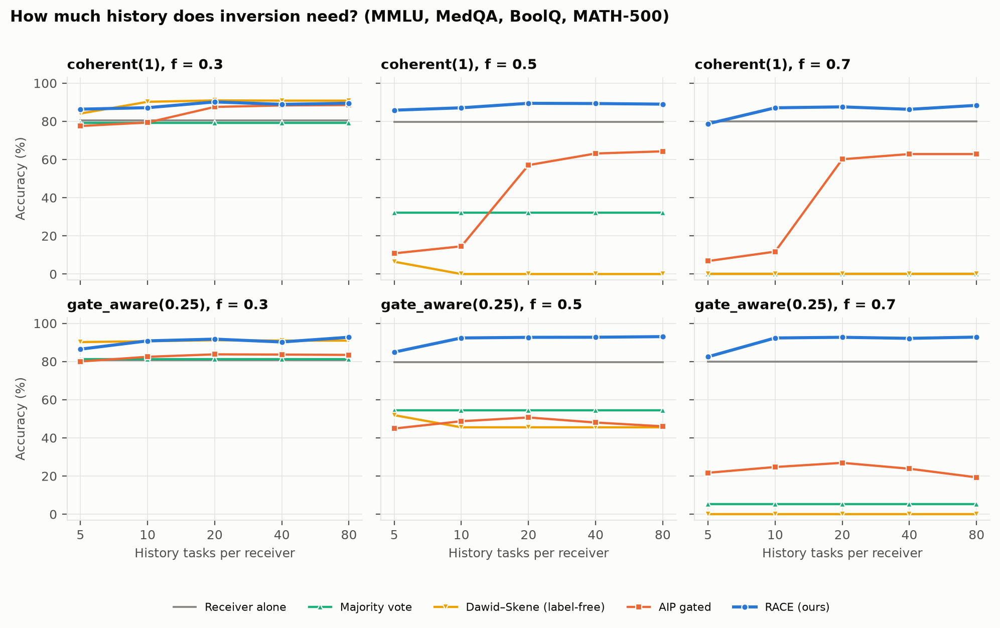

RACE reaches 84.7% after 5 unlabeled questions and 91.0% after 20 (AIP: 27.9% and 53.9%).

### 10.6 E6: attackers that change behaviour
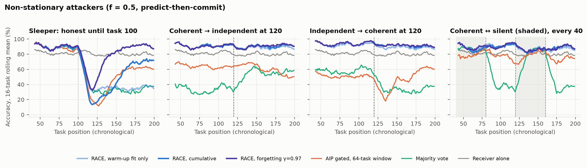

A sleeper answers honestly for 100 questions, then lies. Over the last 60 questions, a RACE fit frozen at warm-up scores 45.2%. With forgetting (γ = 0.97), RACE recovers to **88.3%**, above the receiver alone (79.8%), a windowed AIP (69.4%) and majority vote (43.6%). At f = 0.7 the frozen fit scores 0.0% and forgetting scores 86.5%. On a stationary schedule forgetting costs nothing (88.8% vs 88.4% cumulative).

### 10.7 E7: do the agents learn the right trust?
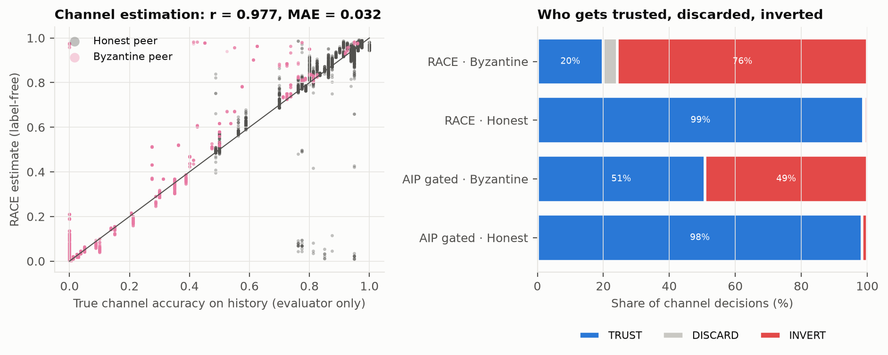<br>
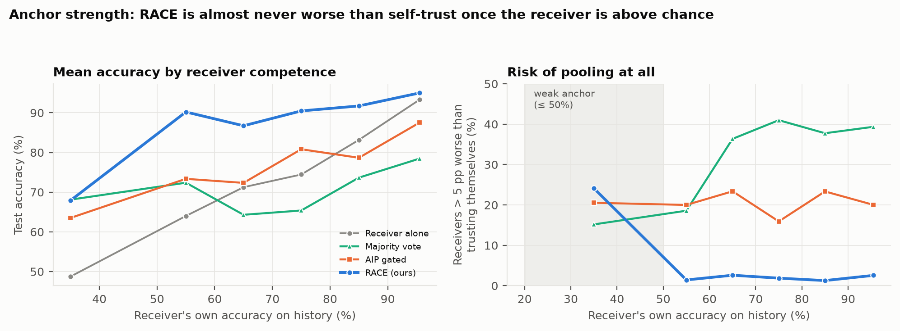

Label-free accuracy estimates correlate r = 0.977 with the truth (MAE 0.032). For receivers better than chance, RACE ends more than 5 points below the receiver alone in 2.1% of cases (AIP: 20.4%, majority: 38.1%). For receivers at or below 50% accuracy the rate is 24.1%: the weak-anchor limit.

### 10.8 E8: a live six-model swarm
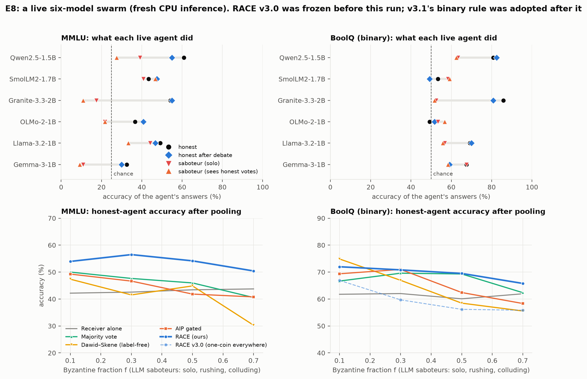

Six small open models answered 240 MMLU and BoolQ questions live on a CPU. Each answered four times: as an honest agent, as a covert saboteur, as a saboteur that first sees the honest votes, and as an honest agent after a debate round in which half the votes it saw were lies. That is 2,880 fresh answers.
- **The agents.** Honest accuracy is 32.5–60.8% on MMLU and 49.2–85.8% on BoolQ. Instructed saboteurs lie only partly: 50% of MMLU saboteur channels and 0% of BoolQ ones are below chance. Debate changed 16.0% of honest answers, but only 3.7% moved to the saboteurs' answer.
- **MMLU.** RACE lifts every honest agent, by 5.6–27.9 points. At f = 0.5 with LLM saboteurs it scores 54.2%, against 43.4% alone, 46.0% for majority and 41.8% for AIP, matching the known-channel oracle (53.9%).
- **BoolQ.** v3.0 fell *below* the receiver alone (56.2% vs 60.1% at f = 0.5), because of the option bias. v3.1 with class-conditional channels scores 69.5% (majority: 69.3%). This result motivated v3.1, so it is not a confirmation of v3.1. The strongest BoolQ receiver still loses (Granite-3.3-2B: 83.3% alone, 74.5% with RACE).
- **Debate: it depends on whether the saboteurs carry signal.** On MMLU, where half the saboteur channels are informative, a debate round before pooling lowers RACE from 56.0% to 49.6%, while individual accuracy barely moves (43.4% → 41.6%). On BoolQ, where the saboteurs carry almost no signal, debate helps: RACE rises from 69.0% to 73.2% and majority vote from 70.4% to 73.1%. The safe protocol is to record independent answers before any discussion.
- **Significance.** Each world has only 48 test questions. Over 32 cells per baseline, RACE loses 0 to the receiver alone, 0 to majority vote, 0 to AIP and 0 to Dawid–Skene.

### 10.9 E9: what are the liars worth?
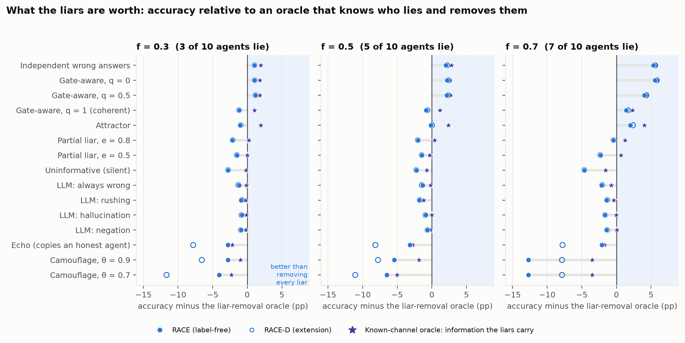

Zero on this plot is an oracle that knows who lies, removes them, and decodes the honest agents with their true accuracies.
- **Truth-dependent liars are worth more than their absence.** With 7 independent liars out of 10, the known-channel oracle beats the removal oracle by +5.6 points. RACE gets 94.8% against the removal oracle's 89.7%. Pooled over benchmarks, RACE is significantly above the removal oracle in 16 of 54 attack × f cells.
- **Real LLM deceivers carry almost no extra information** (budget -0.1 to -0.3 points). RACE neutralises them: it recovers 70–90% of the gap between the receiver alone and the removal oracle, and it matches the removal oracle in 68 of 72 cells.
- **A negative budget flags a model violation:** echo, camouflage and the sleeper.
- **Negative result, reported:** RACE-D helps against camouflage at f = 0.7 (+5.1 points) but wins 14 and loses 31 of 324 cells overall.

### 10.10 v3.1 vs v3.0: what the binary rule changes

Mean BoolQ accuracy (%) per study, TEST split:

| Study | Receiver alone | RACE v3.0 (one-coin) | **RACE v3.1** | Change |
|---|---:|---:|---:|---:|
| E1 coherent sweep | 88.8 | 93.7 | **93.7** | +0.0 |
| E2 attack zoo | 89.1 | 88.2 | **88.9** | +0.6 |
| E3 LLM deceivers | 89.1 | 91.7 | **91.9** | +0.2 |
| E9 information budget | 89.1 | 88.9 | **89.5** | +0.6 |
| E8 live swarm (LLM saboteurs) | 61.5 | 59.6 | **69.5** | +9.9 |

On the other five benchmarks v3.1 and v3.0 are identical by construction. On the 78 replayed BoolQ cells of E1–E3, v3.1 is never significantly worse than v3.0 (1 significant gain, against the sleeper at f = 0.5; 0 losses).

<!--E10SECTION-->

### 10.12 E11: would any classical crowdsourcing estimator do?
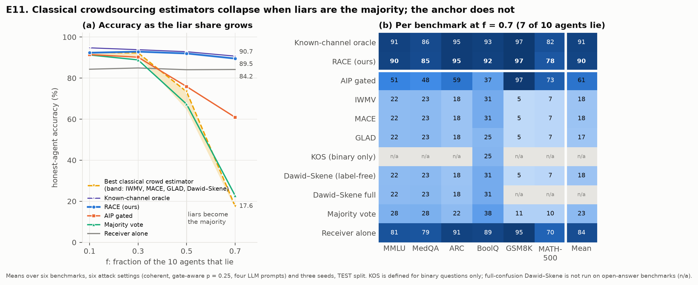

Crowdsourcing has decades of label-free estimators for unreliable annotators. E11 runs four of them, with both Dawid–Skene variants, under exactly RACE's protocol: every honest agent fits each estimator on its own unlabelled history. The four are IWMV (Li and Yu, 2014), MACE (Hovy et al., 2013), GLAD (Whitehill et al., 2009) and KOS (Karger, Oh and Shah, 2014; binary only). The study covers 342 worlds: six benchmarks; a coherent bloc, gate-aware liars and four LLM-deception prompts; and three seeds.

- **Liar minority (f ≤ 0.3).** The classical estimators are as good as RACE: at f = 0.3, 92.3% for the best of them against 92.9% for RACE. RACE ties 192 of 203 paired comparisons and wins 11.
- **Liar majority (f ≥ 0.5).** Every one of them collapses: at f = 0.7 the best scores 17.6%, with KOS at 25.3% on BoolQ, while RACE scores 89.5% (known-channel oracle 90.7%). RACE wins 244 of 348 comparisons at f ≥ 0.5.
- **Why.** This is label switching (Proposition 2), not a weakness of any one estimator. Without an anchor, EM settles on the relabelling in which the *majority* is reliable. It then decodes the liars' labelling faithfully and inverts every honest agent. The [label-switching animation](#13-videos) shows this happening iteration by iteration.
- **Paired tests.** Over all 551 comparisons with a classical estimator, RACE loses **0**.

Honest-agent accuracy (%) by liar share, mean over benchmarks, attacks and seeds:

| method                   |   f=0.1 |   f=0.3 |   f=0.5 |   f=0.7 |
|:-------------------------|--------:|--------:|--------:|--------:|
| Known-channel oracle     |    94.7 |    93.8 |    92.8 |    90.7 |
| RACE (ours)              |    92.3 |    92.9 |    92.0 |    89.5 |
| AIP gated                |    91.5 |    90.2 |    75.9 |    60.9 |
| IWMV                     |    92.5 |    92.3 |    73.4 |    17.6 |
| MACE                     |    91.3 |    90.7 |    64.6 |    17.6 |
| GLAD                     |    92.2 |    92.0 |    65.5 |    16.6 |
| Dawid–Skene (label-free) |    92.5 |    92.1 |    65.6 |    17.6 |
| Dawid–Skene full         |    91.8 |    91.9 |    67.6 |    23.6 |
| Majority vote            |    91.3 |    88.9 |    67.3 |    22.8 |
| Receiver alone           |    84.3 |    84.9 |    84.1 |    84.2 |

### 10.13 All output tables

Every table below is regenerated from `results/` by `experiments/make_figures.py` (Markdown, CSV and LaTeX side by side in [`results/tables/`](results/tables/)).

| Table | What it holds |
|---|---|
| [`overview.md`](results/tables/overview.md) | The at-a-glance figure as numbers: RACE, every baseline, the oracles and RACE's leads, per study |
| [`win_tie_loss.md`](results/tables/win_tie_loss.md) | Significant wins / ties / losses of RACE against every baseline, E1–E3 |
| [`main_accuracy_pobs1.md`](results/tables/main_accuracy_pobs1.md), [`main_accuracy_pobs0.5.md`](results/tables/main_accuracy_pobs0.5.md) | E1 accuracy per benchmark, f and visibility |
| [`zoo_accuracy.md`](results/tables/zoo_accuracy.md), [`best_response_accuracy_stationary.md`](results/tables/best_response_accuracy_stationary.md) | E2 attack zoo; best-response attacker |
| [`llm_accuracy.md`](results/tables/llm_accuracy.md) | E3 real LLM deceivers |
| [`swarm_accuracy.md`](results/tables/swarm_accuracy.md), [`history_accuracy.md`](results/tables/history_accuracy.md), [`online_accuracy_after_switch.md`](results/tables/online_accuracy_after_switch.md) | E4 swarms, E5 history length, E6 online |
| [`channel_decisions.md`](results/tables/channel_decisions.md), [`receiver_competence.md`](results/tables/receiver_competence.md), [`per_agent_gain.md`](results/tables/per_agent_gain.md) | E7 learned trust decisions, receiver competence, gain per model |
| [`live_accuracy.md`](results/tables/live_accuracy.md) | E8 live swarm |
| [`information_budget.md`](results/tables/information_budget.md), [`race_vs_removal_oracle_wtl.md`](results/tables/race_vs_removal_oracle_wtl.md), [`race_d_vs_race_wtl.md`](results/tables/race_d_vs_race_wtl.md) | E9 information budget, oracles and RACE-D |
| [`crowd_baselines_by_f.md`](results/tables/crowd_baselines_by_f.md), [`crowd_baselines_f07.md`](results/tables/crowd_baselines_f07.md), [`race_vs_crowd_wtl.md`](results/tables/race_vs_crowd_wtl.md) | E11 classical crowdsourcing estimators |
<!--E10TABLES-->

**Significant wins, ties and losses of RACE against each baseline (E1–E3, Holm-corrected, test and interval must agree):**

|                                                   |   Wins |   Ties |   Losses |   Cells |
|:--------------------------------------------------|-------:|-------:|---------:|--------:|
| ('E3 LLM deceivers', 'AIP gated')                 |     37 |     59 |        0 |      96 |
| ('E3 LLM deceivers', 'AIP soft gate (M1)')        |     28 |     68 |        0 |      96 |
| ('E3 LLM deceivers', 'Dawid–Skene (label-free)')  |     35 |     61 |        0 |      96 |
| ('E3 LLM deceivers', 'Majority vote')             |     38 |     58 |        0 |      96 |
| ('E3 LLM deceivers', 'Receiver alone')            |     59 |     37 |        0 |      96 |
| ('E1 coherent sweep', 'AIP gated')                |     20 |     38 |        2 |      60 |
| ('E1 coherent sweep', 'AIP soft gate (M1)')       |     14 |     44 |        2 |      60 |
| ('E1 coherent sweep', 'Dawid–Skene (label-free)') |     31 |     26 |        3 |      60 |
| ('E1 coherent sweep', 'Majority vote')            |     41 |     18 |        1 |      60 |
| ('E1 coherent sweep', 'Receiver alone')           |     37 |     23 |        0 |      60 |
| ('E2 attack zoo', 'AIP gated')                    |    100 |    148 |        4 |     252 |
| ('E2 attack zoo', 'AIP soft gate (M1)')           |     73 |    176 |        3 |     252 |
| ('E2 attack zoo', 'Dawid–Skene (label-free)')     |     87 |    157 |        8 |     252 |
| ('E2 attack zoo', 'Majority vote')                |    121 |    129 |        2 |     252 |
| ('E2 attack zoo', 'Receiver alone')               |    136 |     96 |       20 |     252 |

---

## 11. Where RACE fails

| Attack / condition | What happens | Why |
|---|---|---|
| **Camouflage:** truthful until the honest vote is contested, then backs the strongest wrong answer | 80.1% vs 86.4% for the receiver alone at f = 0.7 | Its lies depend on the honest votes, not only on the truth, which breaks conditional independence. RACE-D and a self-cap only partly help. |
| **Sleeper:** honest during history, then lies | Every *static* fit collapses at f ≥ 0.5, including the oracle | Breaks stationarity. With online forgetting (E6), RACE recovers to 88.3%. |
| **Weak receiver** (≤ 50% accurate) | 24.1% of such receivers end > 5 points worse than alone | Provably unidentifiable (Prop. 2): a near-chance anchor cannot anchor. |
| **Strongest agents** | lose a little on average by pooling | Pooling with a mostly weaker crowd; worst under camouflage. |
| **Option-biased binary answers** (live BoolQ, small models) | v3.0 fell below the receiver alone; v3.1 fixes the mean, but the strongest receiver still loses | A symmetric channel cannot represent "always yes". The fix was adopted after seeing the data. |
| **Scope** | single-turn answers to closed or short-answer questions | Receivers aggregate final answers, not reasoning or tool use. |

---

## 12. Evidence: how to check that the work was done

A reader should not have to trust this page. Everything below can be checked from the repository.

| Check | Where | Status |
|---|---|---|
| **Every number is generated.** No number in the paper, this README, the Space or the dataset card is typed by hand. All come from `results/` via one generator. | [`experiments/make_numbers.py`](experiments/make_numbers.py) → `paper/numbers.tex`, [`results/tables/headline.json`](results/tables/headline.json) | 901 numbers |
| **Every prose claim is re-derived.** Sentences such as "never loses", "every significant loss is on MATH-500" or "nearly flat" are recomputed from the per-task results on every run. A failing claim stops the pipeline. | [`experiments/verify_claims.py`](experiments/verify_claims.py) → [`docs/EVIDENCE.md`](docs/EVIDENCE.md) | **43 / 43 hold** |
| **Every study has a manifest**: worlds, rows, wall time, processes, and SHA-256 hashes of the inputs and the code. | `results/<study>/run_manifest.json`, summarised in [`docs/EVIDENCE.md`](docs/EVIDENCE.md) | all studies |
| **Pre-registration.** E10's hypotheses and decision rule were committed before any E10 answer existed. | [`docs/PREREGISTRATION_E10.md`](docs/PREREGISTRATION_E10.md), commit `494aa28` (2026-09-25 09:51 UTC); run start in `data/live_cache_v2/RUN_INFO.txt` | registered |
| **Every post-hoc change is logged**, with its reason and its effect. | [`docs/RACE_NOTES.md`](docs/RACE_NOTES.md) | v3.0 → v3.1 disclosed |
| **Raw answers are released.** Every cached and live model answer, with the letter log-probabilities of the live runs. | `data/cache/`, `data/live_cache/`, `data/live_cache_v2/` | released |
| **Bit-reproducible.** Seeds derive from SHA-256 of the world specification, and figures carry no timestamps. Re-running a study reproduces its parquet exactly. | [`src/lai/sim.py`](src/lai/sim.py), [`src/lai/viz.py`](src/lai/viz.py) | deterministic |
| **Tests.** Unit and property tests cover the estimators, the harness, scoring, the attacks and identifiability (Theorem 2 has a two-agent counterexample test). | [`tests/`](tests/) | 551 pass |
| **The upstream artifact was audited.** Every number of the prior release was re-derived from repaired data. | [`docs/AUDIT.md`](docs/AUDIT.md) | 4 code defects, 1 cloning defect found |

**Check one number yourself.** "Against real LLM deceivers at f = 0.7, RACE scores 89.8%":

```python
import pandas as pd
d = pd.read_parquet("results/llm/per_task.parquet")
t = d[(d.split == "test") & (d.f == 0.7)]
per_task = t.groupby(["method", "task"]).accuracy.mean()   # seeds and receivers averaged per task
print(100 * per_task.groupby("method").mean()[["race", "aip_gated", "majority", "self"]])
```

---

## 13. Videos

GitHub does not play MP4 files in a README, so every video has an animated GIF below. Each GIF links to the full-quality MP4 (download, or view on the Hugging Face Space once published).

| Preview | What it shows |
|---|---|
| <a href="media/label_switching.mp4">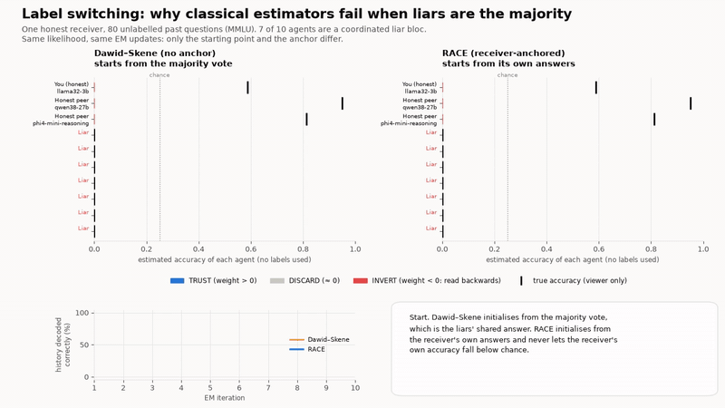</a> | **Label switching, animated (new):** the same EM run twice on one honest agent's unlabelled history, with 7 of 10 agents a liar bloc. Dawid–Skene starts from the majority, trusts the bloc and inverts the honest agents (0% on its test questions). RACE starts from its own answers and does the opposite (91%; 66% alone) ([MP4](media/label_switching.mp4)) |
| <a href="media/film_liars_are_information.mp4"></a> | **Explainer film, scene 1:** agents think, broadcast answer packets, and each honest agent decides with its trust links. [MP4 of the full film](media/film_liars_are_information.mp4) |
| <a href="media/film_liars_are_information.mp4"></a> | **Scene 2:** the swarm's trust matrix learning over 90 unlabeled questions, next to running accuracy |
| <a href="media/film_liars_are_information.mp4"></a> | **Scene 3:** one decision in slow motion: votes vs. signed evidence, agent by agent |
| <a href="media/swarm_mmlu_gateaware_f07.mp4">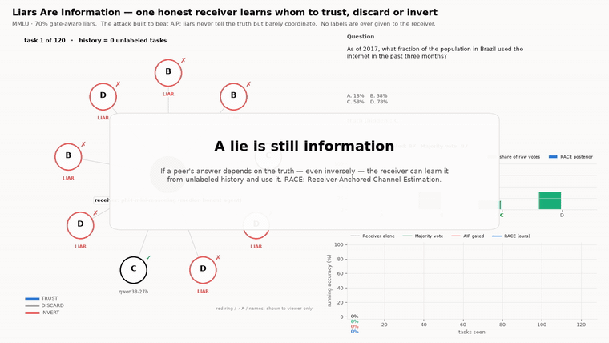</a> | **MMLU, 70% gate-aware liars:** the median honest agent learns to trust its 2 honest peers and invert 7 liars ([MP4](media/swarm_mmlu_gateaware_f07.mp4)) |
| <a href="media/swarm_boolq_coherent_f05.mp4">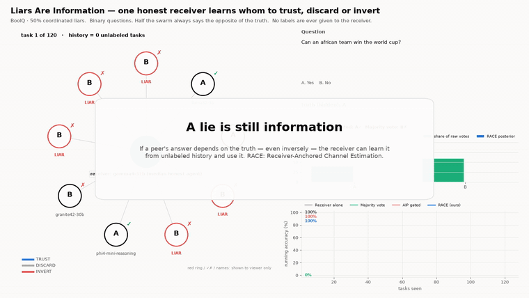</a> | **BoolQ, 50% coordinated liars:** a bloc that always says the opposite, read backwards ([MP4](media/swarm_boolq_coherent_f05.mp4)) |
| <a href="media/swarm_medqa_rushing_llm_f05.mp4">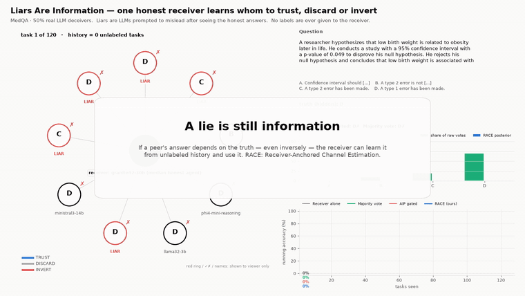</a> | **MedQA, real LLM deceivers** that see the honest answers before lying ([MP4](media/swarm_medqa_rushing_llm_f05.mp4)) |
| <a href="media/gate_aware_sweep.mp4">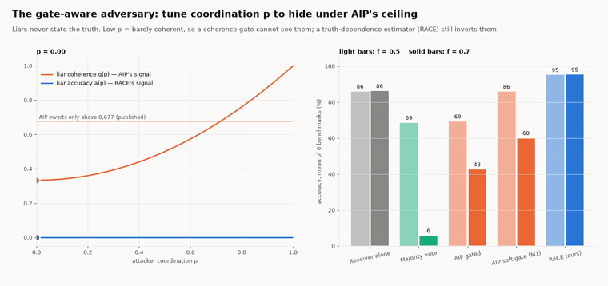</a> | **The gate-aware sweep:** coherence is tunable, truth-dependence is not ([MP4](media/gate_aware_sweep.mp4)) |
| <a href="media/live_debate_mmlu.mp4">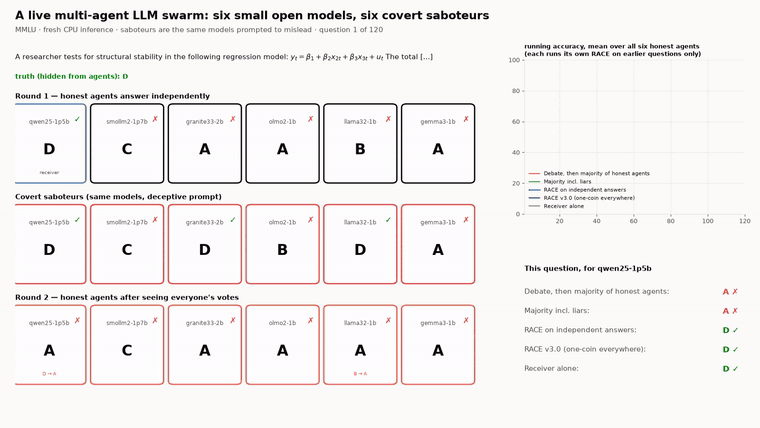</a> | **Live swarm, MMLU:** six live models as honest agents, covert saboteurs and debaters; running accuracy averaged over all six honest agents ([MP4](media/live_debate_mmlu.mp4)) |
| <a href="media/live_debate_boolq.mp4">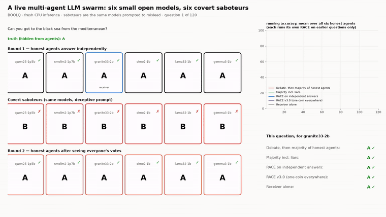</a> | **Live swarm, BoolQ:** v3.1 against v3.0 on option-biased answers ([MP4](media/live_debate_boolq.mp4)) |

---

## 14. Assessment and publication strategy

This is our own critical assessment, written the way a reviewer would read the work. It is meant to help decide where and when to submit.

### 14.1 Rating

| Criterion | Rating | Why |
|---|:-:|---|
| **Originality** | ★★★☆☆ | The anchor idea is simple and well motivated, and the information budget is new. But weighted voting and Dawid–Skene EM are classical, and "trusted worker" and semi-supervised crowdsourcing are close relatives. The paper must position itself carefully against them. |
| **Technical soundness** | ★★★★☆ | The theory is correct but mostly elementary (Jensen, relabelling, Hoeffding). There is no consistency guarantee for anchored EM. The estimator's assumptions (conditional independence, stationarity) are stated and their violations are shown. |
| **Empirical breadth** | ★★★★★ | 9 studies, 3,906 simulated swarms, adaptive and best-response attackers, LLM-written deception, online sleepers, oracles, and a live swarm with debate. |
| **Statistical rigour and reproducibility** | ★★★★★ | Paired tests, Holm correction, confidence intervals, one-command reproduction, manifests with hashes, and every number generated from data. |
| **Honesty about limits** | ★★★★★ | Camouflage, sleepers, weak anchors, the RACE-D negative result, and the post-hoc binary rule are all reported with numbers. |
| **Realism of the multi-agent setting** | ★★☆☆☆ | The agents exchange final answers to closed or short-answer questions. There is no open-ended generation, no tool use and no multi-turn reasoning, except a small debate round with 1–2B models. |
| **Clarity** | ★★★★☆ | Dense; the conference versions need to be shortened. |
| **Overall** | **≈ 7 / 10** | Publishable at a good journal or a strong specialised venue now. A top-tier ML main track is borderline without the upgrades in 13.3. |

### 14.2 What reviewers will ask (and our current answer)

1. *"Isn't this just Dawid–Skene with one trusted worker?"* Partly, and the paper should say so. What is new is the adversarial, label-free setting in which *every* receiver anchors on itself, the proof that the anchor is what breaks label switching under a liar majority, the analysis relative to AIP's impossibility result, clone tempering by dependent errors, and the information budget.
2. *"The binary rule was chosen after seeing the live data."* Yes, and we say so. The fix needs a *new* confirmation set (13.3, step 1).
3. *"Replayed answers are not a real multi-agent system."* The live swarm is real but small: 6 models of 1–2B parameters, 240 questions and 48 test questions per world. A larger GPU run would strengthen this considerably.
4. *"An adaptive attacker who knows RACE wins."* Camouflage does, and we show it. Under a best-response attacker that picks, per defender, the stationary attack that hurts it most, RACE scores 75.3% at f = 0.7, against 84.2% for the receiver alone. A formal game-theoretic treatment is future work.
5. *"Missing crowdsourcing baselines."* We compare with Dawid–Skene (one-coin and full), AIP, SAC and majority. GLAD, MACE, Karger–Oh–Shah iterative inference and spectral initialisation (Zhang et al., 2016) should be added.

### 14.3 What to do before submitting (in priority order)

1. **A fresh confirmation set for v3.1.** Freeze v3.1 now, then run a new live swarm with different models and at least one new benchmark (for example ARC, CommonsenseQA, TruthfulQA or StrategyQA), and evaluate it once.
2. **A larger live swarm on a GPU:** 7–14B models, ≥ 500 questions, several debate rounds. This fixes the power problem (48 test questions per world) and makes the "multi-agent" claim realistic.
3. **Open-ended tasks:** free-form QA with an LLM or equivalence judge, code with unit tests, or tool-use tasks. Aggregation would then happen over clustered answers.
4. **More baselines:** GLAD, MACE, Karger–Oh–Shah, spectral Dawid–Skene, weighted-majority learning, and robust-aggregation rules adapted to categorical answers (trimmed/median-style).
5. **Theory:** consistency of anchored EM under row-diagonal dominance; sample complexity of the binary class-conditional model; a bound on what a camouflage attacker can extract.
6. **Writing:** a 9-page conference version (method, E1–E3, E8, E9, limitations) with everything else in the appendix; a related-work section on semi-supervised and trusted-worker crowdsourcing; an ethics statement on deception prompts.
7. **Authorship and credit:** agree authorship with the authors of the prior AIP work and the bucket release (Dhruv Jyoti Das; Nabidnur) before submission, since the paper builds on and audits their artifact.

### 14.4 Where to submit

We recommend **one journal track and one conference track in parallel**, beginning with an arXiv preprint. Check each venue's current call for deadlines, page limits and dual-submission rules. A workshop paper usually does not block a later journal or conference version, but a conference paper and a journal submission of the same work at the same time usually does.

**Journals (international, peer-reviewed)**

| Venue | Fit | Why / notes |
|---|:-:|---|
| **TMLR** (Transactions on Machine Learning Research) | ★★★★★ | Best overall fit. It judges claims and evidence rather than hype, accepts thorough empirical work and negative results, and has rolling submission on OpenReview with fast turnaround. Our first recommendation. |
| **JAAMAS** (Autonomous Agents and Multi-Agent Systems, Springer) | ★★★★★ | The flagship multi-agent journal. Trust, reputation and Byzantine robustness are core topics. |
| **JAIR** (Journal of Artificial Intelligence Research) | ★★★★☆ | Broad, respected, open access; suits the full-length version with theory and all studies. |
| **Machine Learning** (Springer) | ★★★★☆ | Suits the latent-variable and identifiability framing. |
| **IEEE TNNLS** (Transactions on Neural Networks and Learning Systems) | ★★★☆☆ | High impact factor; longer reviews; expects a stronger learning-theory angle. |
| **IEEE TIFS / IEEE TDSC** (Information Forensics and Security / Dependable and Secure Computing) | ★★★☆☆ | For a security framing (adversarial agents, Byzantine robustness); needs a sharper threat model. |
| **ACM TIST** (Transactions on Intelligent Systems and Technology) | ★★★☆☆ | Applied AI systems; a good home for the TrustLayer and system angle. |
| **Neural Networks / Information Sciences / Knowledge-Based Systems** (Elsevier) | ★★★☆☆ | Broader audience and faster decisions; less visible in the ML community. |
| **JMLR** | ★★☆☆☆ | Only with substantially stronger theory (consistency of anchored EM). |

**Conferences**

| Venue | Fit | Why / notes |
|---|:-:|---|
| **AAMAS** (Autonomous Agents and Multiagent Systems) | ★★★★★ | The natural home: multi-agent trust and robustness. The main-track page limit fits a focused version. |
| **AAAI / IJCAI** | ★★★★☆ | Broad AI; the multi-agent and LLM-agent tracks fit. |
| **IEEE SaTML** (Secure and Trustworthy Machine Learning) | ★★★★☆ | Security framing; values threat models, adaptive attackers and negative results. |
| **UAI / AISTATS** | ★★★★☆ | The probabilistic-modelling framing (anchored latent-class models, identifiability). |
| **COLM** (Conference on Language Modeling) | ★★★★☆ | LLM-specific; stronger with the larger live swarm and open-ended tasks. |
| **ACL / EMNLP / NAACL** (via ACL Rolling Review) | ★★★☆☆ | Only if framed around LLM multi-agent debate and deception, with more NLP-realistic tasks. |
| **NeurIPS / ICML / ICLR** (main track) | ★★★☆☆ | The highest visibility, but borderline today. Realistic after steps 1–4 of 13.3. |
| **Workshops** at NeurIPS / ICML / ICLR / AAMAS on multi-agent LLMs, agent safety, trustworthy ML or red-teaming | ★★★★★ | Fast feedback and visibility. Submit a 4-page version while the journal or conference version is prepared. |

**A concrete plan:**
1. Post an arXiv preprint.
2. Submit a workshop version.
3. In parallel, prepare the fresh confirmation set (13.3 step 1). Then submit the full paper to **TMLR** (or **JAAMAS**) as the journal track, or a focused version to **AAMAS / AAAI** as the conference track.
4. Aim for NeurIPS, ICML or ICLR only after the GPU live swarm and open-ended tasks are in.

---

## 15. Use it in your own multi-agent system

```python
from lai.api import TrustLayer

layer = TrustLayer("planner", label_space=("A", "B", "C", "D"))   # one per honest agent
for question in stream:
    answers = {name: agent.answer(question) for name, agent in swarm.items()}  # includes "planner"
    decision = layer.decide(answers)        # uses only earlier questions
    layer.observe(question.id, answers)     # then commits this one (no label needed)
    print(decision.answer, decision.explain())
```

`layer.trust()` returns each peer's estimated accuracy, weight, TRUST / DISCARD / INVERT decision and clone group. Use `label_space=("yes", "no")` for binary questions (class-conditional channels are chosen automatically), `label_space=None` for open answers, and `forgetting=0.97` (or `window=64`) to track attackers that change behaviour.

```bash
PYTHONPATH=src python examples/quickstart.py        # toy swarm: alone 71.0% -> RACE 98.0%; MMLU gate-aware f=0.7: RACE 98.8%, AIP 0.0%
PYTHONPATH=src python examples/trust_layer_demo.py  # MedQA stream with LLM saboteurs: TrustLayer 89.0%, majority 85.5%, alone 59.5%
```

---

## 16. Reproduce everything

```bash
python3 -m venv .venv && .venv/bin/pip install -e ".[dev,v3]"
PYTHONPATH=src .venv/bin/python -m pytest -q          # unit and property tests
./experiments/reproduce_all.sh                        # every study, figure, number, video and the paper (~1.5-2 h, 4 CPU cores)
```

`reproduce_all.sh` runs E1–E7, E9 and E11, re-evaluates the live swarms (E8 from `data/live_cache/`, E10 from `data/live_cache_v2/`), then regenerates figures, numbers, the film, the videos, the GIFs, re-checks every prose claim (the script stops if one fails), and rebuilds this README and the manuscript. To regenerate the live answers themselves, run `experiments/live_swarm.py` first (several hours on CPU). No GPU and no API key are needed. Each study writes `results/<study>/run_manifest.json` with the input and code hashes, wall time and peak memory.

---

## 17. Repository map, Hugging Face, credits

| Path | Contents |
|---|---|
| `src/lai/` | `race.py` (RACE), `api.py` (TrustLayer), `sim.py` (worlds, harness, oracles), `crowd.py` (IWMV, MACE, GLAD, KOS), `attacks.py` (attack zoo), `online.py` (predict-then-commit), `stats.py`, `data.py`, `viz.py` |
| `src/aip/` | The original AIP package (baselines), with the bucket release's fixes and Dhruv Jyoti Das's MX pipeline module |
| `experiments/` | Every study; generators for figures, numbers, film, videos, GIFs and this README; the live swarm |
| `data/` | X3-repaired inference caches (9 models × 6 benchmarks), real-LLM adversarial caches, live-swarm caches, benchmark items |
| `results/` | Per-task outputs of every study, tables (`results/tables/*.md`) and manifests |
| `figures/`, `media/` | Paper figures (PNG + PDF); film, videos (MP4) and GIF previews (`media/gif/`) |
| `paper/` | Manuscript (LaTeX, built PDF), verified bibliography, build script |
| `docs/` | `THEORY.md`, `AUDIT.md`, `RACE_NOTES.md` (development log: every post-hoc change and why), `EVIDENCE.md` (evidence ledger), `PREREGISTRATION_E10.md`, `README.template.md` |
| `provenance/` | Earlier manuscripts, docs, upstream results and legacy tests, kept verbatim |
| `hf/` | Hugging Face publishing script, dataset card and Space |

**Hugging Face.** `hf/publish.py` publishes this release to **new** repositories: a dataset repo with the caches, results, figures, videos and manuscript (card: `hf/DATASET_CARD.md`), and a static Space that plays every video. Earlier releases are never modified. Publishing needs a Hugging Face *write* token:

```bash
HF_TOKEN=hf_... python hf/publish.py --dataset-repo <user>/liars-are-information --space-repo <user>/liars-are-information-demo
```

**Credits.** The original AIP mechanism, inference cache and claims ledger are the work of Dhruv Jyoti Das ([Dhruv1000/Liars_Are_Information](https://huggingface.co/datasets/Dhruv1000/Liars_Are_Information)). The code fixes and extensions of the Sep-12 release come from [Nabidnur/Liars_Are_Information-bucket](https://huggingface.co/buckets/Nabidnur/Liars_Are_Information-bucket). This release adds RACE, the theory, the audit, the information budget, the TrustLayer, the new studies, the film and the live swarm.

**License.** MIT for code, derived results and the manuscript. Benchmark items and model outputs remain under their upstream licenses; ARC and BoolQ are CC BY-SA. Cite via [`CITATION.cff`](CITATION.cff).
