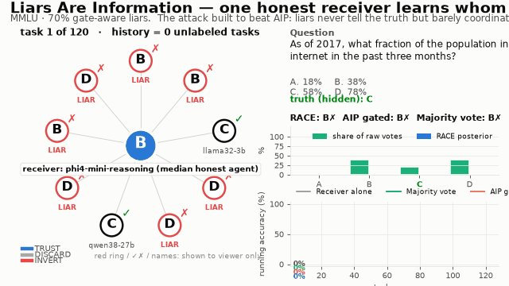

# Liars Are Information — v3: Receiver-Anchored Channel Estimation (RACE)

**When some agents in a multi-agent LLM system lie, can the honest ones still use what the liars say?**
Yes, provided a liar's answers depend on the truth. An agent that never tells the truth still rules out one answer every time it speaks. This release turns that idea into a method (**RACE**), proves when it works and when it cannot, and tests it against 16 attack types (9 symbolic, 4 written by real LLM deceivers, 3 from a live six-model swarm).

<p align="center">
  <br>
  <sub>One honest receiver (centre) in a 10-agent swarm where <b>7 agents lie</b>, using the attack that defeats the original AIP gate. No labels are ever given. Blue edges = TRUST, red = INVERT, â = the receiver's label-free estimate of each peer's accuracy.
  Full videos: <a href="media/swarm_mmlu_gateaware_f07.mp4">MMLU, 70% gate-aware liars</a> · <a href="media/swarm_boolq_coherent_f05.mp4">BoolQ, 50% coordinated liars</a> · <a href="media/swarm_medqa_rushing_llm_f05.mp4">MedQA, real LLM deceivers</a> · <a href="media/gate_aware_sweep.mp4">the gate-aware sweep</a> · <a href="media/live_debate_mmlu.mp4">live LLM debate</a></sub>
</p>

## Headline results

Accuracy of honest receivers (%). TEST split. Mean over six benchmarks, nine models and several seeds. Every number is regenerated by `experiments/make_numbers.py`.

| Setting | Receiver alone | Majority vote | Dawid–Skene (label-free) | AIP gated (prior work) | **RACE (ours)** | Known-channel oracle |
|---|---:|---:|---:|---:|---:|---:|
| Coherent liars, f = 0.5 | 83.8 | 41.2 | 0.0 | 74.3 | **90.7** | 94.0 |
| Coherent liars, f = 0.9 | 85.8 | 0.0 | 0.0 | 0.0 | **88.0** | 88.5 |
| BoolQ (binary), coherent, f = 0.7 | 88.8 | 0.0 | 0.0 | 0.0 | **93.7** | — |
| Gate-aware liars (AIP's defeat), f = 0.7 | 86.4 | 3.9 | — | 48.5 | **95.0** | — |
| **Real LLM deceivers**, f = 0.5 ✳ | 85.7 | 75.9 | 89.2 | 83.0 | **92.7** | 93.2 |
| **Real LLM deceivers**, f = 0.7 ✳ | 85.8 | 29.4 | 22.7 | 70.8 | **89.8** | 91.0 |

✳ *Confirmation set*: not inspected until the method was frozen. Across 480 Holm-corrected paired tests on it, RACE has **196 significant wins and 0 losses**.

What else we found:
* **The channel estimates are accurate.** RACE never sees a label, yet its estimate of each peer's accuracy correlates **r = 0.977** with the truth (MAE 0.032, 27,216 channels). It inverts **75.7%** of liar channels (AIP: 49.2%) and wrongly inverts **0.8%** of honest ones (AIP: 1.5%).
* **It needs little history.** RACE reaches 85.4% after **5** unlabeled questions and 91.0% after 20. AIP reaches 27.9% and 53.9%.
* **It is safe for competent receivers.** For receivers better than chance, RACE ends more than 5 points worse than trusting themselves in about 2% of cases. The rate for AIP is about 20%, and for majority 19–41%.

## Where RACE fails (reported as prominently)

| Attack / condition | What happens | Why |
|---|---|---|
| **Camouflage** (tells the truth until a vote is contested, then backs the strongest wrong answer) | 80.2% vs 86.4% for the receiver alone at f = 0.7 | Its lies depend on the honest votes, which breaks conditional independence |
| **Sleeper** (honest during history, then lies) | Every static method collapses at f ≥ 0.5, including the oracle | Breaks stationarity; see the online study |
| **Weak receiver** (≤ 50% accurate on open answers) | 24% of such receivers end worse than trusting themselves | Provably unidentifiable (Prop. 2): a near-chance anchor cannot anchor |
| **MATH-500, f ≤ 0.3** | Trails AIP and majority by up to 10 points | The weak-anchor case above |

## What is new in v3

1. **RACE.** Each honest receiver fits a latent-truth model to its own unlabeled history. The model is *anchored on the receiver*: initialisation, a prior and a constraint all encode the one thing the receiver knows, that it is itself honest. Every peer gets a signed log-odds weight λ = log((K−1)·a/(1−a)): positive means TRUST, negative INVERT, zero DISCARD. Replicated agents are grouped by *error-conditioned* agreement. → [`src/lai/race.py`](src/lai/race.py)
2. **Theory** ([`docs/THEORY.md`](docs/THEORY.md)):
   * Against a receiver that knows the channels, a lie can only add information. The attacker's best move is to be uninformative, so there is **no breakdown point below f = 1** (Theorem 1).
   * Label-free estimators must fail at f ≥ ½ because of label switching. A receiver anchor restores identifiability, and a near-chance anchor provably cannot (Prop. 2).
   * AIP's gate is a coarse quantisation of the Bayes weight. The coherence impossibility (the original work's Prop. 1) does not bind a truth-dependence estimator (Prop. 3).
   * A sample-complexity bound (Prop. 4) and a clone-detection result (Prop. 5).
3. **Evaluation.** 2,592 replayed worlds; 13 replay attack types, 4 of them written by real LLMs; best-response adaptive attackers; online sleepers; paired Wilcoxon tests with Holm correction.
4. **A live multi-agent LLM swarm.** Six small open models (Qwen2.5, SmolLM2, Granite-3.3, OLMo-2, Llama-3.2, Gemma-3) answer in honest, covert-saboteur and debate roles. This is fresh CPU inference, evaluated after the method was frozen. → [`experiments/live_swarm.py`](experiments/live_swarm.py)
5. **An audit and a repaired artifact.** The upstream post-repair recompute was incomplete. We also found four code defects and a replica-cloning defect in the pipeline extension. Every number here is re-derived from the repaired cache. → [`docs/AUDIT.md`](docs/AUDIT.md)

## Figures

| | |
|---|---|
|  |  |
| **E1**: coherent liars from f = 0 to 0.9 | **E2**: the attack zoo (Δ vs. receiver alone) |
|  |  |
| The gate-aware adversary | **E3**: real LLM deceivers (confirmation set) |
|  |  |
| **E7**: label-free channel estimates vs truth | Anchor strength vs. risk of pooling |
|  |  |
| **E5**: history needed | Best-response adaptive attacker |
|  |  |
| Coherence is tunable; truth-dependence is not | **E6**: sleepers and regime switches, online |

## Quick start

```bash
PYTHONPATH=src python examples/quickstart.py
# peer 4: estimated accuracy 0.01 -> INVERT   (a liar that never coordinates)
# toy swarm, 60% liars: receiver alone 71.0%, RACE 98.0%
# MMLU, 70% gate-aware liars: {'self': '76.7%', 'majority': '13.8%', 'aip_gated': '0.0%', 'race': '98.8%'}
```

```python
from lai.race import RACEAggregator
race = RACEAggregator(("A", "B", "C", "D"))       # label_space=None for open answers
race.fit(history)                                  # list of (Observation,) tuples: no labels
answer = race.aggregate(broadcasts, receiver_id)   # signed, receiver-anchored vote
race.diagnostics.channels[receiver_id]             # per-peer accuracy estimate + TRUST/DISCARD/INVERT
```

## Reproduce

```bash
python3 -m venv .venv && .venv/bin/pip install -e ".[dev,v3]"
PYTHONPATH=src .venv/bin/python -m pytest -q          # unit + property tests
./experiments/run_all.sh                              # E1–E6 on cached answers (CPU, ~1 h on 4 cores)
.venv/bin/python experiments/analysis_extra.py        # E7 channel diagnostics
.venv/bin/pip install -e ".[live]"                    # torch (CPU) + transformers
.venv/bin/python experiments/live_swarm.py            # E8 live swarm (~2 h on 4 cores)
.venv/bin/python experiments/eval_live.py
.venv/bin/python experiments/make_figures.py && .venv/bin/python experiments/make_numbers.py
.venv/bin/python experiments/make_videos.py           # MP4 + GIF explainer videos
cd paper && TECTONIC=/path/to/tectonic ./build.sh     # manuscript PDF
```

No GPU and no API key are needed. Each study writes `results/<study>/run_manifest.json` with the input and code hashes, wall time and peak memory.

## Repository map

| Path | Contents |
|---|---|
| `src/lai/` | **v3**: `race.py` (RACE), `sim.py` (worlds and harness), `attacks.py` (attack zoo), `online.py` (predict-then-commit), `stats.py`, `data.py`, `viz.py` |
| `src/aip/` | The original AIP package (baselines), with the bucket release's fixes and Dhruv Jyoti Das's MX pipeline module |
| `experiments/` | Every study, the figure, number and video generators, and the live swarm |
| `data/` | The X3-repaired inference caches (9 models × 6 benchmarks), real-LLM adversarial caches, live-swarm caches, and the benchmark items used |
| `results/` | Per-task outputs of every study, tables (`results/tables/*.md`) and manifests |
| `figures/`, `media/` | Paper figures (PNG and PDF) and explainer videos (MP4 and GIF) |
| `paper/` | The v3 manuscript (LaTeX), verified bibliography and build script |
| `docs/` | `THEORY.md`, `AUDIT.md`, `RACE_NOTES.md` (development log: every post-hoc change and why) |
| `provenance/` | Both earlier manuscripts, their docs, the upstream results and the legacy artifact tests, kept verbatim |
| `hf/` | Hugging Face publishing script and cards |

## Hugging Face

* Earlier artifacts this work builds on: [`Dhruv1000/Liars_Are_Information`](https://huggingface.co/datasets/Dhruv1000/Liars_Are_Information) (the original AIP study and its X3-repaired cache) and [`Nabidnur/Liars_Are_Information-bucket`](https://huggingface.co/buckets/Nabidnur/Liars_Are_Information-bucket) (the Sep-12 derivative release).
* This release is published to **new** repositories with `hf/publish.py`: a dataset repo holding the caches, results, figures, videos and manuscript (card: `hf/DATASET_CARD.md`), and a Space showing the videos and figures. Earlier releases are never modified.

```bash
HF_TOKEN=hf_... python hf/publish.py --dataset-repo <user>/liars-are-information --space-repo <user>/liars-are-information-demo
```

## Credits and license

MIT for code, derived results and the manuscript. Benchmark items and model outputs remain under their upstream licenses: ARC and BoolQ are CC BY-SA. The original AIP mechanism, inference cache and claims ledger are the work of Dhruv Jyoti Das ([Dhruv1000/Liars_Are_Information](https://huggingface.co/datasets/Dhruv1000/Liars_Are_Information)). The code fixes and extensions of the Sep-12 release come from [Nabidnur's bucket](https://huggingface.co/buckets/Nabidnur/Liars_Are_Information-bucket). v3 adds RACE, the theory, the audit, the new studies and the live swarm.
