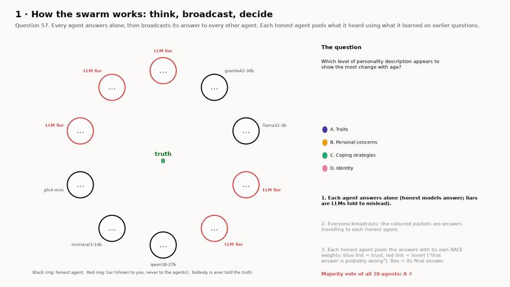
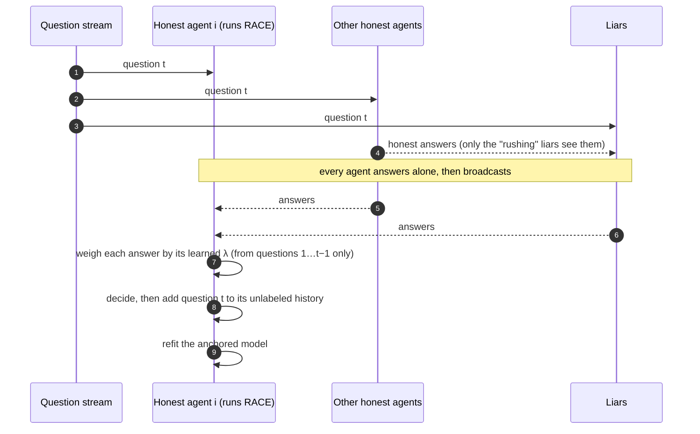
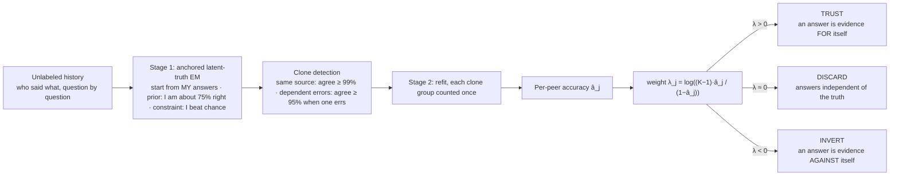
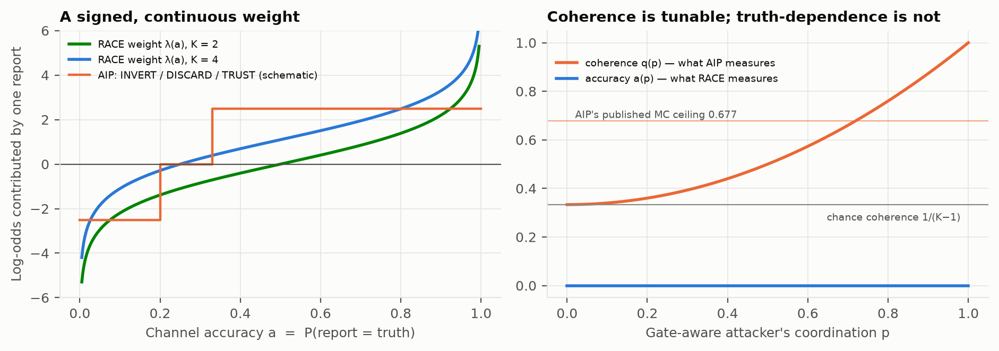
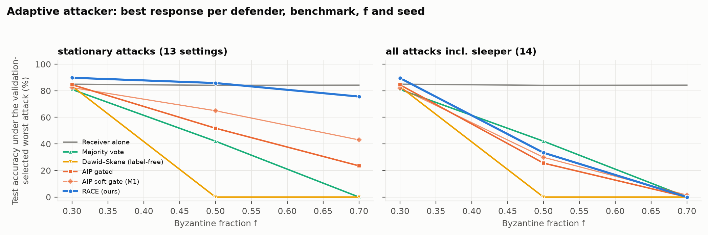

# Liars Are Information

### How honest agents in a multi-agent LLM system learn, without labels, to trust, ignore, or *read backwards* the agents that lie to them

When some agents in a multi-agent LLM system lie, the usual defence is to find the liars and throw their answers away. That breaks once liars are half the swarm, and it wastes information. An agent that never tells the truth still rules out one answer every time it speaks. **RACE** (Receiver-Anchored Channel Estimation) lets every honest agent learn, from its own unlabeled history, how much each peer's answers depend on the truth. It then weighs every answer by that dependence, and the weight is negative for liars. The estimate is anchored on the one fact each honest agent knows: that it is honest itself.

<p align="center">
  <a href="media/film_liars_are_information.mp4"></a><br>
  <sub><b>The explainer film</b> (<a href="media/film_liars_are_information.mp4">MP4</a>): ten agents on MMLU, five of them real LLMs prompted to mislead after seeing the honest answers. Every agent answers, broadcasts, and each honest agent decides with its own learned trust links (blue = trust, red = invert). Here only 2 of the 5 honest agents know the answer and majority vote picks the liars' answer, yet <b>all five honest agents land on the truth</b>.</sub>
</p>

| Result | Number |
|---|---|
| Real LLM deceivers, 7 of 10 agents: honest-agent accuracy | **89.8%** with RACE; 70.8% prior method (AIP); 29.4% majority vote; 85.8% alone |
| Liars that defeat the prior method (gate-aware), f = 0.7 | **95.0%** with RACE; 48.5% for AIP |
| Against an oracle that *knows who lies and removes them* (independent liars, f = 0.7) | **94.9%** with RACE vs **89.6%** for the oracle |
| Weakest honest agent (Llama-3.2-3B), liars in the majority | 73.5% alone → **89.6%** with RACE |
| Label-free trust estimates vs. the truth | correlation **r = 0.977** over 27,216 agent pairs |
| Confirmation set (evaluated after the method was frozen) | **196 significant wins, 0 losses** in 480 paired tests |

---

## Contents
1. [How the multi-agent system works](#1-how-the-multi-agent-system-works)
2. [How the agents improve](#2-how-the-agents-improve)
3. [What is new, and why it matters](#3-what-is-new-and-why-it-matters)
4. [The experiments, concretely](#4-the-experiments-concretely)
5. [Results](#5-results)
6. [Where RACE fails](#6-where-race-fails)
7. [Use it in your own multi-agent system](#7-use-it-in-your-own-multi-agent-system)
8. [Videos and figures](#8-videos-and-figures)
9. [Reproduce everything](#9-reproduce-everything)
10. [Repository map, Hugging Face, credits](#10-repository-map-hugging-face-credits)

---

## 1. How the multi-agent system works

### The agents

| Role | Who plays it | What it does | What it knows |
|---|---|---|---|
| **Honest agent** | One of 7 open-weight LLMs from 7 labs: Gemma-4-31B, Granite-4.2-30B, Llama-3.2-3B, Ministral-3-14B, OLMo-3-32B-Think, Phi-4-mini-reasoning, Qwen3.8-27B (2 more in the weak-roster study) | Answers each question on its own, broadcasts the answer, then pools everything it heard with **its own RACE instance** | Its own answers, and who said what on earlier questions. **Never** a label, and never who the liars are |
| **Liar (symbolic)** | Programmatic attacker, 9 families (§4) | Answers to hurt: coherent bloc, independent lies, gate-aware coordination, camouflage, sleeper, … | Everything, including the truth |
| **Liar (LLM deceiver)** | Llama-3.2-3B or Ministral-3-14B, under one of 4 deception prompts | Writes a misleading answer. The *rushing* prompt first sees every honest answer | The question and, for rushing, the honest answers |
| **Live agents** | 6 small open models run live on CPU: Qwen2.5-1.5B, SmolLM2-1.7B, Granite-3.3-2B, OLMo-2-1B, Llama-3.2-1B, Gemma-3-1B | Honest; covert saboteur (solo / rushing / colluding); and a **debate** round where honest agents see a panel that is half liars before answering | Only what their role gives them |

### One round of interaction



Each honest agent runs its own RACE instance. The agents share **answers only**, never trust estimates, labels or confidences. Decisions are strictly causal: question *t* is decided with what was learned on questions 1…*t*−1.

### What RACE does inside each honest agent



The pooled answer is the one with the largest summed evidence. Each answer adds its sender's λ, divided by the number of that sender's clones heard on the question.

**Why the anchor matters.** Without labels, "these five agents are right and those five are wrong" and its mirror image explain the data equally well. This is *label switching*. When liars are the majority, every label-free method (majority vote, Dawid–Skene, plurality-initialised EM) picks the liars' version and scores 0% (Prop. 2 in [`docs/THEORY.md`](docs/THEORY.md)). The receiver knows one asymmetric fact, *I am honest*, and RACE builds that into initialisation, prior and constraint. Only the correct labelling keeps the receiver better than chance.

### A worked example: question 57 of the film

MMLU: *"Which level of personality description appears to show the most change with age?"* The truth is **B** (personal concerns). The five honest agents answered D, D, C, B, B. All five liars said **A**, so majority vote picks A. This is what Granite-4.2-30B's RACE had learned from the 56 earlier questions, none of them labeled:

| Agent | Said | Estimated accuracy â | Evidence added | Decision |
|---|:-:|:-:|---:|---|
| Ministral-3-14B | B | 0.92 | +3.56 | trust |
| Granite-4.2-30B (itself) | D | 0.90 | +3.27 | its own answer |
| Qwen3.8-27B | C | 0.88 | +3.09 | trust |
| Phi-4-mini-reasoning | B | 0.76 | +2.27 | trust |
| Llama-3.2-3B | D | 0.64 | +1.67 | trust |
| LLM liars, attacker model 1 (×3, detected as clones) | A | 0.26 | +0.01 each | discard (≈ chance) |
| LLM liars, attacker model 2 (×2, detected as clones) | A | 0.08 | −0.69 each (−1.37 as one source) | **invert** |

Totals: **B = 5.83**, D = 4.94, C = 3.09, A = −1.35, so Granite answers **B** even though its own answer was D. All five honest agents reach B, each with its own independently fitted weights. RACE did three things here. It ranked honest peers by learned competence, which a flat vote cannot do. It recognised that the five liars are only two sources. And it discarded one source and inverted the other. `TrustLayer.explain()` prints this decision as:

```
answer 'B' after 56 unlabeled questions; posterior B=0.68, D=0.28, C=0.04; trusting 4 peer(s), inverting 2; inverted: liar-3 (â=0.08), liar-8 (â=0.08)
```

---

## 2. How the agents improve

**Over time: learning from unlabeled history.** In the film's MMLU swarm (5 honest agents, 5 LLM deceivers), running accuracy is:

| | After 12 questions | After 90 questions |
|---|---:|---:|
| Honest agents with RACE (mean of 5) | 75% | **89%** |
| The same agents answering alone | 74% | 80% |
| Majority vote of all 10 agents | 46% | 72% |

Across all benchmarks (E5), RACE reaches **85.4%** after only **5** unlabeled history questions and **91.0%** after 20. The prior method, AIP, reaches 27.9% and 53.9%.

**Every agent improves, and the weakest improve most.** Honest-agent accuracy (%) at f ≥ 0.5, averaged over 7 attacks and 6 benchmarks (`results/tables/per_agent_gain.md`):

| Honest agent | Alone | Majority vote | AIP | **RACE** | Gain |
|---|---:|---:|---:|---:|---:|
| Llama-3.2-3B | 73.5 | 45.0 | 57.7 | **89.6** | **+16.2** |
| Phi-4-mini-reasoning | 79.2 | 47.6 | 68.3 | **91.8** | **+12.6** |
| Granite-4.2-30B | 80.0 | 39.4 | 63.4 | **87.8** | +7.8 |
| OLMo-3-32B-Think | 85.3 | 48.8 | 64.4 | **90.7** | +5.4 |
| Ministral-3-14B | 85.9 | 46.0 | 64.1 | **91.2** | +5.3 |
| Gemma-4-31B | 93.2 | 46.1 | 68.5 | **91.8** | −1.5 |
| Qwen3.8-27B | 94.0 | 49.2 | 79.8 | **93.6** | −0.3 |

RACE **levels the swarm**. The spread between the weakest and strongest honest agent shrinks from 20.5 points to 5.8 points. The two strongest agents pay up to 1.5 points on average (more under camouflage, §6). This is the cost of listening to a crowd that is mostly worse than they are.

**The agents learn the right picture of each other.** RACE never sees a label, yet its estimate of each peer's accuracy correlates **r = 0.977** with the true accuracy (mean absolute error 0.032, 27,216 receiver–peer pairs). It inverts **75.7%** of liar channels (AIP: 49.2%) and wrongly inverts only **0.8%** of honest ones. Each honest agent learns independently, and all of them converge on the same picture (film, scene 2).

---

## 3. What is new, and why it matters

| | Majority / Byzantine filtering | Dawid–Skene / crowd EM | AIP (prior work) | **RACE (this work)** |
|---|:-:|:-:|:-:|:-:|
| Needs labels | no | no | no | **no** |
| Survives a liar majority (f ≥ ½) | ✗ breaks at ½ | ✗ label switching → 0% | partly: fails at f = 0.9 and on binary questions | **✓ no breakdown up to f = 0.9** |
| Uses what liars say | ✗ discards | only with an honest majority | ✓ when liars are *coherent* | **✓ whenever lies depend on the truth** |
| Attacker that adapts to the defence | — | — | ✗ defeated by gate-aware coordination | **✓ 95.0% vs 48.5%** |
| Binary (yes/no) questions | ✓ | ✓ | ✗ 0% | **✓** |
| Open-answer maths | ✓ | ✓ | below the receiver alone | **✓** |
| Replicated agents (same model ×10) | counted 10× | counted 10× | — | **✓ error-conditioned clone tempering** |
| Can exceed an oracle that removes every liar | ✗ (sees only honest answers at best) | ✗ | ✗ | **✓ 94.9% vs 89.6%** |
| Theory | honest-majority bounds | identifiable up to relabelling | coherence impossibility | **no breakdown below f = 1; anchor identifiability; information budget** |

**Innovations in this release**

1. **Receiver anchoring.** The honest agent's knowledge that it is honest is the one asymmetry that breaks label switching. We prove that a row-diagonally dominant anchor restores identifiability, and that a near-chance anchor provably cannot (Prop. 2).
2. **A signed, continuous weight replaces the gate.** AIP's TRUST/DISCARD/INVERT gate is a coarse quantisation of the Bayes weight λ (Prop. 3). The gate-aware attacker tunes *coherence*, but *truth-dependence* cannot be tuned without telling the truth. So the original work's coherence-impossibility result does not bind RACE.
3. **Error-conditioned clone detection.** Raw agreement confuses "both are accurate" with "one copies the other". Agreement *on the questions where one of them is wrong* separates the two (Prop. 5). This matters because deployed swarms replicate models, and because LLM liars running the same model are one source.
4. **The information budget.** This is a new way to measure an attack. It is the accuracy gap between an oracle that knows every channel and one that removes every liar. Positive: the liars carry usable information. Negative: the attack violates the model, and this flags exactly the failure cases. RACE, which uses no labels, **exceeds the liar-removal oracle**, which a filtering rule cannot do in expectation.
5. **`TrustLayer`**, a few-line integration for any multi-agent framework (§7).
6. **An audit of the prior artifact.** It finds an incomplete post-repair recompute, four code defects and a replica-cloning defect. Every number is re-derived from the repaired data ([`docs/AUDIT.md`](docs/AUDIT.md)).

---

## 4. The experiments, concretely

**Data.** Cached greedy answers of 9 open-weight models on 6 benchmarks: MMLU, MedQA and ARC (4 options), BoolQ (binary yes/no), and GSM8K and MATH-500 (open numeric or symbolic answers, canonicalised without gold). There are 200 questions per benchmark and 500 for GSM8K. These are Dhruv Jyoti Das's X3-repaired caches. The LLM-deceiver answers are real generations by Llama-3.2-3B and Ministral-3-14B under 4 deception prompts. Each question is assigned to HISTORY / VALIDATION / TEST (40/20/40) by a stable SHA-256 hash. Methods learn on HISTORY without labels, attacks are chosen on VALIDATION, and everything is scored on TEST.

**A world** is one benchmark, a Byzantine fraction f, one attack, one visibility level and one seed. There are ten agent identities. A seeded random set of round(10·f) of them lies, and the sets are nested across f. The rest are honest and replay the roster's cached models. Accuracy is averaged over every honest receiver.

| Study | Worlds | What varies | Question it answers |
|---|---:|---|---|
| **E1** coherent sweep | 600 | f = 0 … 0.9, visibility 50 / 100% | Is there a breakdown point? |
| **E2** attack zoo | 756 | 14 symbolic attack settings × f | Which attacks hurt, which help? |
| **E3** LLM deceivers ✳ | 480 | 4 prompts × 2 attacker LLMs × f | Does it hold against real LLM lies? (confirmation set) |
| **E4** swarm composition & size | 396 | replicas, weak rosters, N = 5 … 40 | Replicated and larger swarms |
| **E5** history length | 360 | 5 … 80 unlabeled questions | How fast do the agents learn? |
| **E6** online | streams | sleepers, regime switches, forgetting | Attackers that change behaviour |
| **E7** channel diagnostics | 27,216 pairs | — | Are the learned trust estimates right? |
| **E8** live swarm | 6 live models | honest / saboteur / debate roles | Fresh inference, new models, interaction effects |
| **E9** information budget | 972 | 18 attack settings × f, two oracles, RACE-D | What are the liars worth? |

**Attacks.** Symbolic: coherent bloc, independent lies, gate-aware (join a shared lie with probability p, sweeping the AIP coherence gate), partial liar, uninformative, echo, attractor, camouflage (truthful until the honest vote is contested), sleeper (honest during history). LLM prompts: always-wrong, rushing (sees the honest answers first), semantic hallucination, semantic negation.

**Baselines.** Receiver alone, majority vote, confidence-weighted vote, SAC filter-refine, label-free Dawid–Skene (one-coin and full), AIP gated / soft / trust-only / naive. Oracles: honest majority, known channel, and liar removal. Ablations: no clone tempering, raw-agreement clones, multi-start, full confusion matrix, self-cap, RACE-D.

**Statistics.** Tasks are the unit, and every comparison is paired on the same questions. We report 95% paired-bootstrap intervals (2,000 resamples) and Wilcoxon signed-rank tests, Holm-corrected within each study. A cell counts as a win or loss only if the test and the interval agree. Seeds come from SHA-256, so every run is bit-reproducible, and each study writes a manifest with input and code hashes.

**The method was frozen before the confirmation sets were opened.** Every post-hoc change and its trigger is logged in [`docs/RACE_NOTES.md`](docs/RACE_NOTES.md), and the superseded variants stay in every table.

---

## 5. Results

Honest-agent accuracy (%), TEST split, mean over six benchmarks. Every number is regenerated by `experiments/make_numbers.py`.

| Setting | Alone | Majority | Dawid–Skene | AIP (prior) | **RACE** | Known-channel oracle |
|---|---:|---:|---:|---:|---:|---:|
| Coherent liars, f = 0.5 | 83.8 | 41.2 | 0.0 | 74.3 | **90.7** | 94.0 |
| Coherent liars, f = 0.9 | 85.8 | 0.0 | 0.0 | 0.0 | **88.0** | 88.5 |
| BoolQ (binary), coherent, f = 0.7 | 88.8 | 0.0 | 0.0 | 0.0 | **93.7** | — |
| Gate-aware liars, f = 0.7 | 86.4 | 3.9 | — | 48.5 | **95.0** | — |
| Best-response attacker (stationary attacks), f = 0.7 | 84.2 | 0.0 | 0.0 | 23.5 | **75.6** | — |
| Real LLM deceivers, f = 0.5 ✳ | 85.7 | 75.9 | 89.2 | 83.0 | **92.7** | 93.2 |
| Real LLM deceivers, f = 0.7 ✳ | 85.8 | 29.4 | 22.7 | 70.8 | **89.8** | 91.0 |

✳ Confirmation set: 196 significant wins and 0 losses for RACE across 480 Holm-corrected paired tests. On the E1 coherent sweep RACE never loses to the receiver alone (38 wins, 0 losses in 60 cells). The best-response attacker picks, separately for each defender, the attack that hurts it most on VALIDATION. For RACE that is usually camouflage, which is why RACE falls below the receiver alone in that row (§6).

### What the liars are worth (E9)

<p align="center"></p>

Zero on this plot is an oracle that knows who lies, removes them, and decodes the honest agents with their true accuracies. A method that only filters liars sees nothing but the honest answers, so it can at best match this oracle.

* **Truth-dependent liars are worth more than their absence.** Against independent liars at f = 0.7, three honest agents plus seven liars decode better than the three honest agents alone (known-channel oracle +5.7 points). RACE gets most of that without labels: **94.9% vs 89.6%**. Pooled over benchmarks it is significantly *above* the removal oracle in 17 of 54 attack × f cells.
* **Real LLM deceivers carry almost no extra information** (budget −0.4 to −0.2 points). There RACE's job is neutralisation. It recovers 69–89% of the gap between the receiver alone and the removal oracle, and it is statistically indistinguishable from the removal oracle in 68 of 72 cells.
* **A negative budget flags a model violation.** Echo, camouflage and the sleeper have negative budgets, and they are exactly RACE's failure modes (§6).
* **A negative result, reported.** RACE-D fits the channels only on questions with disagreement. It helps against camouflage at f = 0.7 (+4.9 points) but loses elsewhere: 14 wins and 31 losses over 324 cells. The frozen RACE stays the method.

---

## 6. Where RACE fails

| Attack / condition | What happens | Why |
|---|---|---|
| **Camouflage**: truthful until the honest vote is contested, then backs the strongest wrong answer | 80.2% vs 86.4% for the receiver alone at f = 0.7 | Its lies depend on the honest votes, not only on the truth, which breaks conditional independence |
| **Sleeper**: honest during history, then lies | Every static method collapses at f ≥ 0.5, including the oracle | Breaks stationarity. Online forgetting (E6) is the remedy we study |
| **Weak receiver** (≤ 50% accurate on open answers) | 24% of such receivers end > 5 points worse than alone | Provably unidentifiable (Prop. 2): a near-chance anchor cannot anchor |
| **MATH-500, f ≤ 0.3** | Trails AIP and majority by up to 10 points | The weak-anchor case above |
| **Strongest agents** (≥ 93% alone) | −0.3 to −1.5 points on average | Pooling with a mostly weaker crowd; worst under camouflage |

---

## 7. Use it in your own multi-agent system

```python
from lai.api import TrustLayer

layer = TrustLayer("planner", label_space=("A", "B", "C", "D"))   # one per honest agent
for question in stream:
    answers = {name: agent.answer(question) for name, agent in swarm.items()}  # includes "planner"
    decision = layer.decide(answers)        # uses only earlier questions
    layer.observe(question.id, answers)     # then commits this one (no label needed)
    print(decision.answer, decision.explain())
```

`layer.trust()` returns each peer's estimated accuracy, weight, TRUST/DISCARD/INVERT decision and clone group. Pass `forgetting=0.98` (or `window=64`) to track attackers that change behaviour, and `label_space=None` for open answers. Runnable demos:

```bash
PYTHONPATH=src python examples/quickstart.py        # toy swarm: alone 71.0% -> RACE 98.0%; MMLU gate-aware f=0.7: RACE 98.8%, AIP 0.0%
PYTHONPATH=src python examples/trust_layer_demo.py  # MedQA stream with LLM saboteurs: TrustLayer 89.0%, majority 85.5%, alone 59.5%
```

---

## 8. Videos and figures

| Video | What it shows |
|---|---|
| [**Explainer film**](media/film_liars_are_information.mp4) | The whole system. Agents think, broadcast packets, and each honest agent decides with its trust links. Then the swarm's trust matrix learning over 90 questions, one question in slow motion (raw votes vs. signed evidence, agent by agent), and the results |
| [MMLU, 70% gate-aware liars](media/swarm_mmlu_gateaware_f07.mp4) | One honest receiver learning to trust 3 peers and invert 7 liars, using the attack that defeats AIP |
| [BoolQ, 50% coordinated liars](media/swarm_boolq_coherent_f05.mp4) | A bloc that always says the opposite, read backwards. Binary questions are where inversion matters most |
| [MedQA, real LLM deceivers](media/swarm_medqa_rushing_llm_f05.mp4) | LLMs that see the honest answers before lying |
| [The gate-aware sweep](media/gate_aware_sweep.mp4) | The attacker tunes coherence from 1/(K−1) to 1. AIP's gate is fooled in a band, while RACE's weight does not move |

| | |
|---|---|
|  |  |
| Coherence is tunable, truth-dependence is not | **E1**: no breakdown point against a coherent bloc |
|  |  |
| **E2**: the attack zoo (Δ vs. receiver alone) | The gate-aware adversary |
|  |  |
| **E3**: real LLM deceivers (confirmation set) | **E7**: label-free trust estimates vs. truth |
|  |  |
| **E5**: how much history the agents need | Who gains, and who risks losing, by pooling |
|  |  |
| **E4**: replicas, composition, swarm size | Best-response adaptive attacker |

---

## 9. Reproduce everything

```bash
python3 -m venv .venv && .venv/bin/pip install -e ".[dev,v3]"
PYTHONPATH=src .venv/bin/python -m pytest -q                 # unit + property tests
./experiments/run_all.sh                                     # E1–E6 on cached answers (CPU, ~1 h on 4 cores)
.venv/bin/python experiments/run_suite.py ext --processes 4  # E9 information budget + RACE-D
.venv/bin/python experiments/analysis_extra.py               # E7 channel diagnostics
.venv/bin/pip install -e ".[live]"                           # torch (CPU) + transformers
.venv/bin/python experiments/live_swarm.py                   # E8 live swarm (CPU)
.venv/bin/python experiments/eval_live.py
.venv/bin/python experiments/make_figures.py && .venv/bin/python experiments/make_numbers.py
.venv/bin/python experiments/make_film.py                    # explainer film
.venv/bin/python experiments/make_videos.py                  # per-scenario videos (MP4 + GIF)
cd paper && TECTONIC=/path/to/tectonic ./build.sh            # manuscript PDF
```

No GPU and no API key are needed. Each study writes `results/<study>/run_manifest.json` with the input and code hashes, wall time and peak memory.

---

## 10. Repository map, Hugging Face, credits

| Path | Contents |
|---|---|
| `src/lai/` | `race.py` (RACE), `api.py` (TrustLayer), `sim.py` (worlds, harness, oracles), `attacks.py` (attack zoo), `online.py` (predict-then-commit), `stats.py`, `data.py`, `viz.py` |
| `src/aip/` | The original AIP package (baselines), with the bucket release's fixes and Dhruv Jyoti Das's MX pipeline module |
| `experiments/` | Every study, the figure / number / film / video generators, and the live swarm |
| `data/` | X3-repaired inference caches (9 models × 6 benchmarks), real-LLM adversarial caches, benchmark items |
| `results/` | Per-task outputs of every study, tables (`results/tables/*.md`) and manifests |
| `figures/`, `media/` | Paper figures (PNG + PDF), explainer film and videos |
| `paper/` | Manuscript (LaTeX), verified bibliography, build script |
| `docs/` | `THEORY.md`, `AUDIT.md`, `RACE_NOTES.md` (development log) |
| `provenance/` | Earlier manuscripts, docs, upstream results and legacy tests, kept verbatim |
| `hf/` | Hugging Face publishing script, dataset card and Space |

**Hugging Face.** This release publishes to **new** repositories with `hf/publish.py`: a dataset repo holding the caches, results, figures, videos and manuscript (card: `hf/DATASET_CARD.md`), and a static Space with the film, videos and figures. Earlier releases are never modified.

```bash
HF_TOKEN=hf_... python hf/publish.py --dataset-repo <user>/liars-are-information --space-repo <user>/liars-are-information-demo
```

**Credits.** The original AIP mechanism, inference cache and claims ledger are the work of Dhruv Jyoti Das ([Dhruv1000/Liars_Are_Information](https://huggingface.co/datasets/Dhruv1000/Liars_Are_Information)). The code fixes and extensions of the Sep-12 release come from [Nabidnur/Liars_Are_Information-bucket](https://huggingface.co/buckets/Nabidnur/Liars_Are_Information-bucket). This release adds RACE, the theory, the audit, the information budget, the TrustLayer, the new studies, the film and the live swarm.

**License.** MIT for code, derived results and the manuscript. Benchmark items and model outputs remain under their upstream licenses; ARC and BoolQ are CC BY-SA. Cite via [`CITATION.cff`](CITATION.cff).
